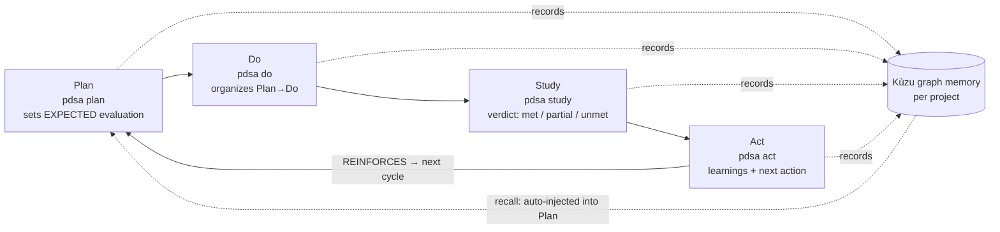

# PDSA Continuous-Improvement Cycle (`pdsa` CLI)

Run work through Deming's PDSA (Plan → Do → Study → Act) loop, recording every step into a
**per-project graph DB (Kùzu)**. The more cycles you run, the more that project's learnings
accumulate — a long-term memory for AI agents.

## Cycle at a glance

One task = at least one full cycle. **Read each step's CLI output and feed it into the real work** —
the loop is worthless if you only record it.

## 0. Decide how to invoke the CLI (once)

From this repo root, pick the usable form. Read `pdsa` in this document as the form you picked.

- If `pdsa version` works → just use `pdsa`.
- Otherwise, dev-tree form: `dotnet run --project src/pdsa-cli -- <command>`.
  - If you'll call it often, build once — it's faster:
    `dotnet build src/pdsa-cli -c Release` → then `src/pdsa-cli/bin/Release/net10.0/pdsa <command>`.

## 1. Pre-flight

1. **Verify the LLM connection**: `pdsa check`
   - On success (✔), proceed.
   - On failure, ask the user to configure it:
     `pdsa config key <key>` or `pdsa config key-file <path>` (keeps the key out of the transcript),
     plus `pdsa config model <model>`.
     Check supported models with `pdsa models --filter gpt-5.6` (default `gpt-5.6-terra`).
2. **Select the project**: `pdsa project set <project-name>` (usually the current repo name).
   - Everything from here is recorded into that project's DB. Inspect with `pdsa project show`,
     `pdsa project list`.
   - **Concurrent runs (multi-project)**: `project set` is global per-user state, so running several
     projects in parallel will overwrite each other. Instead, add `--project <name>` to each command
     and that invocation alone runs against that project's DB (falls back to global / current
     directory when omitted). The CLI is stateless and exits after each call, so different projects
     have separate DBs and never collide.
     - e.g. `pdsa plan "…" --project svc-a` and `pdsa plan "…" --project svc-b` at the same time.

## 2. One cycle (P → D → S → A)

1. **Plan** — state what you're about to do.
   `pdsa plan "<what, why, how>"`
   → Read the **`기대 평가:` (expected result)** line — a verifiable success criterion — and the
   coaching/hypothesis prose. Drive the work toward validating that expected result.
   → Learnings from recent cycles are **auto-injected** into the coaching (accumulated-memory
   feedback). Disable with `--no-recall`.
2. **Do** — report what you actually did.
   `pdsa do "<actual changes / commands / observations>"`
   → Read the **[Plan→Do 정리]** section to see where execution diverged from the plan.
3. **Study** — report results and observations, including measurements.
   `pdsa study "<numbers and observations; did the hypothesis hold?>"`
   → Read the **[학습·개선점]** section. The question is "what did we learn?", not "did it pass?".
4. **Act** — get the next improvement action.
   `pdsa act`  (optional: `--note "<memo>"`)
   → Take the **[다음 개선 액션]** and carry it into the next cycle's `pdsa plan`.

## 3. Operating rules

- **Summarize each step's output for the user** (hypothesis / gap / learnings / next action) and
  **apply it to the following work**.
- Don't stop at planning — actually validate the hypothesis `plan` set, and leave the learning in
  `study`.
- When switching between repos/projects, run `pdsa project set <name>` at the start (memories stay
  separate). For genuinely parallel runs, skip `project set` and pass `--project <name>` per command
  (see §1.2).
- **Tip (not official) — split by role**: to run several streams inside one project in parallel, use
  `<project>-<role>` as separate project names with `--project` so each role gets its own cycle
  (e.g. `myrepo-frontend`, `myrepo-infra`). Only one "in-progress cycle" is tracked per project, so
  split the name when you need concurrency.
- Inspect accumulated state: `pdsa status` (recent cycles/steps). Graph visualization: `pdsa view`
  (local-port viewer).
- Text with quotes or newlines can be passed as-is (stored safely via parameter binding).

## 4. Command summary

| Command | Purpose |
|---|---|
| `pdsa project set/list/show/clear` | Select/list the active project (per-project DB separation) |
| `pdsa plan "…"` | Enter a plan → hypothesis & metric coaching (starts a new cycle) |
| `pdsa do "…"` | Report execution → Plan→Do graph summary |
| `pdsa study "…"` | Report results → learnings & improvement points |
| `pdsa act [--note "…"]` | Next improvement action (closes the cycle) |
| `pdsa recall ["<topic>"]` | Re-read past cycle learnings as planning context; `plan` injects it automatically |
| `pdsa history [--from n] [--to n]` | Timeline of every cycle, **oldest first**: expected → verdict → actual → learning |
| `pdsa show [<n>]` | One cycle in full: all four phases, metrics, reinforcement links (defaults to the latest) |
| `pdsa status` / `pdsa view` | Accumulated state / graph viewer |
| `pdsa update [--check]` | Check for and install the latest version (global npm); `--check` only checks |
| `pdsa config …` / `pdsa check` / `pdsa models` | LLM key & model setup / connection check / model list |

Full help: `pdsa` (no args) or `pdsa <command> --help`.

## 5. Structured output for agents (`--json`) & memory recall (`recall`)

Don't regex-scrape the prose (the coaching is Korean). Adding **`--json`** to
`plan`/`do`/`study`/`act`/`status`/`eval`/`recall` emits exactly one JSON object on stdout (prose
banners suppressed; default output unchanged). It exposes the fields the CLI already parsed, so
parsing is stable (camelCase).

- `plan --json` → `{project, cycle, reinforceOf, expected, narrative, llmEnabled}`
- `study --json` → `{project, cycle, expected, verdict, actual, narrative, llmEnabled}` (`verdict` = `met|partial|unmet`)
- `act --json` → `{project, cycle, reinforce, what, narrative, hitRate:{met,total}, cycleCount, llmEnabled}`
- `status --json` → all cycles/steps, untruncated. `eval --json` → expected/verdict/actual per cycle.
- `recall ["<topic>"] --json` → `{project, topic, learnings:[{cycle, verdict, expected, actual, study, act}]}`
- `history --json` → `{project, cycleCount, hitRate, cycles:[…]}` · `show --json` → `{project, cycle, reinforces, reinforcedBy}`
  (both reuse `status`'s cycle/phase shape, so one parser covers all three)

Recall: use `pdsa recall "<topic>"` to pull related past learnings as context before planning
(omit the topic for the most recent learnings).
For full prose state, use `pdsa status --full` / `pdsa eval --full` (disables truncation).
`llmEnabled:false` means no LLM is configured, so coaching/verdicts were skipped and only the record
was written — don't judge by exit code alone.
