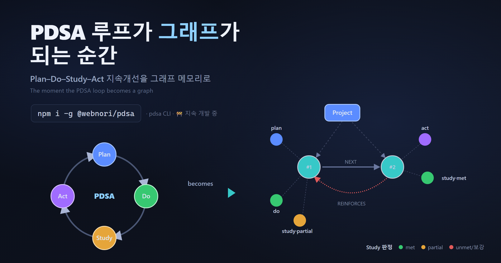
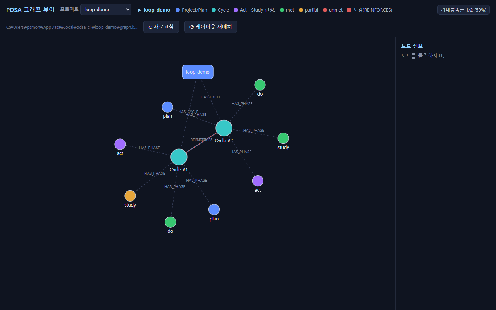

# akka-graph-loop

**[English](README.md) · 한국어**



## 🛠️ `pdsa` — PDSA × 그래프 엔지니어링 서포트 툴

```bash
npm i -g @webnori/pdsa      # Windows x64 · Linux x64 · macOS (Apple Silicon)
pdsa version
```

**`pdsa`** 는 데밍의 **PDSA(Plan–Do–Study–Act) 지속개선 루프**를 **그래프 엔지니어링**으로 지원하는
CLI 서포트 툴이다. Plan 에서 세운 *기대 평가*를 Study 에서 LLM 이 판정(met/partial/unmet)하고, 각 사이클을
**프로젝트별 Kùzu 그래프 메모리**에 누적해 "AI 에이전트를 위한 장기 메모리"를 만든다.
🚧 **지속 개발 중** — 이 툴이 자라난 학습 프로젝트(akka-graph-loop) 전체 소개는 아래에 이어진다.

---

**Akka.NET Streams의 Graph 기능을 조사하고, 각 개념을 실제로 돌려보며 배우는 학습용 프로젝트.**

선형 `Source → Flow → Sink` 파이프라인으로는 표현할 수 없는 **fan-out(1→N 분기)** · **fan-in(N→1 합류)**,
재사용 가능한 **partial graph**, 그리고 이 저장소 이름처럼 가장 까다로운 **사이클/피드백 loop(데드락 vs liveness)** 까지
— Akka.NET Graph DSL의 핵심을 개념·예제·테스트·시각화로 한 번에 정리했다.

## 이 프로젝트가 제공하는 것

- 📄 **조사 문서** — [`docs/akka-net-graph-조사.md`](docs/akka-net-graph-조사.md)
  Graph 개념, junction 카탈로그, partial graph, cycle 데드락 처리 4패턴을 한글로 정리(버전별 API 주의점 포함).
- 🧩 **실행 샘플** — `src/AkkaGraphLoop.Samples`
  GraphDSL 기본 · fan-in/out junction 전체 · partial graph · 사이클 3가지 해법을 실제로 돌려보는 예제.
- 🎬 **TUI 튜토리얼** — 각 그래프의 흐름을 **실제 스트림에 연결된** ASCII 애니메이션으로 단계별 관찰(스텝당 ~5초, ESC 일시정지, Ctrl+C 종료).
- 🔁 **PDSA 루프** — 데밍의 Plan–Do–Study–Act 지속개선 사이클을 실제 피드백 그래프로 구현한 별도 실행 샘플(`-- pdsa`). 각 회차는 스트림 진행 중 **Kùzu 임베디드 그래프 DB**에 실시간 기록되고 Cypher 로 되읽는다.
- 🖥️ **그래프 뷰어** — 기록된 Kùzu 그래프를 **별도 웹 프로젝트**로 시각화(로컬 포트, 외부 CDN 없는 SVG 포스 레이아웃).
- 🛠️ **pdsa-cli** — AI 에이전트가 PDSA 루프를 실행/기록·조회하고 LLM 조언을 받는 공식 CLI. **Native AOT 단일 실행 파일**(Akka+Kùzu 포함, 검증 완료).
- 🧪 **테스트** — `tests/AkkaGraphLoop.Tests`
  xUnit + Akka TestKit 으로 각 junction의 동작과 **사이클의 liveness(데드락 없음)** 를 검증(총 22개).

## 무엇을 배우나

- `GraphDsl.Builder` 로 junction을 연결해 비선형 그래프를 조립하는 법
- fan-out(`Broadcast`/`Balance`/`UnZip`)과 fan-in(`Merge`/`MergePreferred`/`Zip`/`ZipWith`/`Concat`)의 차이와 용법
- `UniformFanInShape` · `Source/Flow.FromGraph` 로 재사용 가능한 컴포넌트를 만드는 법
- 유한 버퍼(bounded) 때문에 사이클이 **데드락**하는 이유와, `MergePreferred` / `Buffer(DropHead)` / `ZipWith 균형+초기주입` 으로 **liveness** 를 확보하는 법

**기술 스택:** `Akka.Streams` 1.5.70 · .NET 10 · xUnit / Akka.TestKit

## 빌드 & 테스트

```bash
dotnet build
dotnet test
```

## TUI 튜토리얼 모드 (기본)

인자 없이 실행하면 **TUI 튜토리얼**이 시작된다. 각 그래프 샘플을 순차로 하나씩 보여주며,
ASCII 다이어그램 위에서 원소가 스테이지를 지날 때마다 활성 노드가 하이라이트된다.

```bash
dotnet run --project src/AkkaGraphLoop.Samples
# 또는
dotnet run --project src/AkkaGraphLoop.Samples -- tui
```

- **실제 스트림에 연결**: 각 junction 사이에 계측 스테이지(`SelectAsync`)를 끼워 넣었고,
  출력은 **실제 `Sink.ForEach`** 가 받은 값이다. 화면의 흐름은 진짜 그래프의 흐름이다.
- **스텝당 ~5초**: 계측 스테이지가 원소를 5초간 붙잡아(=Akka backpressure) 그래프가 스텝 단위로 진행된다.
- **조작키**
  - `ESC` — 현재 작업 **일시정지 / 재개** (backpressure 로 그래프가 그 자리에서 멈춘다)
  - `Ctrl+C` (또는 `Q`) — **종료**

장면 순서: Broadcast+Merge → Balance → UnZip → Zip → ZipWith → Concat → PickMaxOfThree
→ Cycle(MergePreferred) → Cycle(Buffer DropHead) → Cycle(Balanced ZipWith).

## 개별 데모 단발 실행

번호를 주면 해당 그래프를 한 번에(빠르게) 실행하고 결과만 출력한다.

```bash
dotnet run --project src/AkkaGraphLoop.Samples -- <데모번호>
```

| 번호 | 데모 | 번호 | 데모 |
|---|---|---|---|
| 0 | GraphDSL 기본(Broadcast+Merge) | 8 | Partial - Source.FromGraph(홀/짝 페어) |
| 1 | FanOut - Balance | 9 | Partial - Flow.FromGraph |
| 2 | FanOut - UnZip | 10 | Cycle - MergePreferred (해법 1) |
| 3 | FanIn - Zip | 11 | Cycle - Buffer DropHead (해법 2) |
| 4 | FanIn - ZipWith(Max) | 12 | Cycle - Balanced ZipWith (해법 3) |
| 5 | FanIn - Concat | 99 | Cycle - 순진한 데드락 시연(2초 가드) |
| 6 | FanIn - MergePrioritized | | |
| 7 | Partial - PickMaxOfThree | | |

예:

```bash
dotnet run --project src/AkkaGraphLoop.Samples -- 10
# [MergePreferredCycle] => [1, 2, 3, ... , 20]
```

## PDSA 루프 (Deming) — 별도 실행

데밍(W. Edwards Deming)의 **PDSA(Plan–Do–Study–Act)** 지속개선 루프를 **실제 Akka.Streams 피드백 사이클**로
구현한 독립 샘플이다. `Act` 의 결과가 다음 `Plan` 으로 되먹여지며, 품질이 목표에 도달하면 수렴하고 종료한다.
그리고 **각 회차는 스트림 진행 '중' Kùzu 임베디드 그래프 DB에 실시간 기록**되고, 종료 후 Cypher 로 되읽어 보여준다.

```bash
dotnet run --project src/AkkaGraphLoop.Samples -- pdsa
```

```
 seed ─▶ (MergePreferred) ─▶ Plan ─▶ Do ─▶ Study ─▶ Act ─▶ Record(Kùzu) ─▶ TakeWhile(미달) ─▶ Broadcast ─▶ Sink
              ▲                                                                              │
              └───────────────────── (다음 회차 준비) ◀── Feedback ◀────────────────────────┘
```

- MergePreferred 의 우선 포트로 피드백을 넣어 데드락 없이 루프가 흐른다(liveness).
- 목표 품질 도달 시 `TakeWhile(inclusive)` 이 수렴 원소까지 방출하고 루프를 종료(수렴).
- **Record 스테이지**가 각 회차를 `(:Run)-[:HAS_CYCLE]->(:Cycle)` 및 `(:Cycle)-[:NEXT]->(:Cycle)` 그래프로 실시간 기록.
- **데밍 포인트**: 3단계는 PDCA 의 'Check(잘 됐나?)'가 아니라 **'Study(무엇을 배웠나?)'** — 분석적 학습이 루프를 굴린다.

실행 예(그래프 되읽기):

```
■ Kùzu 그래프 되읽기 (경로 길이 NEXT×4):  DB=…\pdsa_kuzu_xxxx
    (:Cycle #1)  품질=65.2  수렴=False
    ...
    (:Cycle #5)  품질=90.0  수렴=True
```

### 내장 그래프 DB: Kùzu

기록에는 **Kùzu**(*"graph DB계의 SQLite/DuckDB"* — 인프로세스 임베디드 그래프 DB, Cypher)를 사용한다.
공식 NuGet 이 없어, C API 를 P/Invoke(`Kuzu/KuzuNative.cs`)하고 네이티브 `libkuzu`(약 12MB)는
**빌드 시 자동 다운로드**한다(`native/Kuzu.targets`, 버전 고정 v0.11.3, 현재 OS/아키텍처에 맞춰 출력 폴더로 복사).
git 에는 바이너리를 커밋하지 않으며 첫 빌드에만 네트워크가 필요하다.

> 참고: "애플이 인수해 오픈소스화한" DB는 **FoundationDB**(2015 인수 → 2018 오픈소스)이지만, 이는 분산 KV 스토어라
> 인프로세스 임베디드 그래프 용도에는 맞지 않아 Kùzu 를 채택했다.

### 그래프 뷰어 (별도 프로젝트, 로컬 포트)

기록된 Kùzu 그래프를 **분리된 웹 프로젝트**(`AkkaGraphLoop.Viewer`)에서 시각화한다.
ASP.NET Core 최소 API 가 DB 를 읽어(읽기 전용) `/api/graph` JSON 으로 제공하고, 외부 CDN 없는
자체 포함 HTML(vanilla JS + SVG 포스 레이아웃)로 그래프를 그린다.



> `pdsa view` 실제 화면: 헤더의 프로젝트 드롭다운·기대충족률 뱃지, Study 노드의 판정색
> (met=초록·partial=주황·unmet=빨강), 보강 사이클을 잇는 `REINFORCES` 엣지가 함께 보인다.

```bash
# 1) 데이터 생성(고정 경로에 기록)
dotnet run --project src/AkkaGraphLoop.Samples -- pdsa
# 2) 뷰어 실행 → 브라우저에서 http://localhost:5099
dotnet run --project src/AkkaGraphLoop.Viewer
```

- 옵션: `--port <번호>`(기본 5099), `--db <경로>`(기본 = 샘플과 공유하는 고정 경로).
- Run(파란 사각형) · Cycle(원, 수렴 시 초록) 노드, `HAS_CYCLE`(점선) · `NEXT`(실선 화살표) 엣지.
- 노드 클릭 시 우측 패널에 속성(품질/수렴 등) 표시, 드래그 이동, 새로고침·재배치 버튼.
- 뷰어는 매 요청마다 DB 를 읽기 전용으로 열고 닫으므로, `-- pdsa` 를 다시 돌린 뒤 새로고침하면 최신 그래프가 보인다.

## pdsa-cli — 공식 CLI 툴 (Native AOT)

**PDSA 루프 엔지니어를 지원하는 CLI.** AI 에이전트가 데밍의 PDSA 사이클을 수행하도록 코칭하고,
각 단계를 **프로젝트별 그래프 DB에 누적**해 "AI 에이전트를 위한 진보된 메모리"를 만든다.
재사용 코어는 별도 라이브러리 **`AkkaGraphLoop.Core`**(PDSA 엔진 + Kùzu)로 추출했고, Samples·Viewer·CLI 가 공유한다.

> 실행 형태: 배포 시 네이티브 단일 실행 파일 `pdsa`(권장). 개발 트리에서는
> `dotnet run --project src/pdsa-cli -- <명령>` 으로 대체한다. 아래 지침의 `pdsa` 를 이 형태로 바꿔 읽으면 된다.

### AI 에이전트 운영 지침 (Agent Guide)

이 CLI 는 AI 에이전트(예: Claude Code)가 **작업을 PDSA 사이클로 수행**하며 학습을 그래프 메모리에
누적하도록 설계됐다. 아래 블록을 에이전트에게 그대로 전달하면 된다.

#### 에이전트에게 줄 지침 (복사해서 사용)

```text
너는 `pdsa` CLI 로 PDSA 지속개선 루프를 수행한다. 어떤 작업이든 아래 순서를 따른다.

0. (최초 1회) LLM 설정 확인: `pdsa check` 가 성공하는지 본다. 실패하면 사용자에게
   `pdsa config key <키>`(또는 `key-file <파일>`)와 `pdsa config model <모델>` 설정을 요청한다.
1. 프로젝트 지정: `pdsa project set <프로젝트명>` (한 번). 이후 모든 기록이 이 프로젝트 DB 에 쌓인다.
2. Plan: 이번에 할 일을 `pdsa plan "<계획>"` 으로 입력한다. 출력의 [가설]과 [측정 지표]를 반드시 읽고,
   그 가설을 검증하는 방향으로 실제 작업을 진행한다.
3. Do: 실제로 수행한 내용을 `pdsa do "<수행한 것>"` 로 보고한다. 출력의 [Plan→Do 정리]를 확인한다.
4. Study: 작업 결과/관찰(측정값 포함)을 `pdsa study "<결과>"` 로 보고한다. 출력의 [학습·개선점]을 읽는다.
5. Act: `pdsa act` 를 실행해 [다음 개선 액션]을 받는다. 그 액션을 반영해 2번(plan)으로 돌아가 새 사이클을 시작한다.

- 언제든 `pdsa status` 로 누적 상태를, `pdsa view` 로 그래프를 확인한다.
- 각 단계의 출력(가설/정리/학습/개선점)을 사용자에게 요약해 전달하고, 반드시 다음 작업에 반영한다.
- 한 작업 = 최소 한 사이클(P→D→S→A). 여러 프로젝트를 오갈 땐 매번 `pdsa project set` 으로 전환한다.
```

#### 왜 이렇게 하나
- 대개 계획만 하고 **가설을 세우지 않는다** → `plan` 이 검증 가능한 가설·측정 지표를 강제한다.
- 매 사이클이 그래프에 쌓여 **프로젝트별 장기 메모리**가 되고, 반복할수록 공정 자체가 개선된다.
- `study` 는 'Check(잘 됐나?)' 가 아니라 '무엇을 배웠나?' 이므로, 에이전트는 결과를 **학습**으로 환원한다.

#### 반복/자동화: Claude Code 스킬로 만들기
"다음에도 이 흐름을 자동 반복하게 하려면" 에이전트에게 **스킬 생성**을 요청한다. 예시 프롬프트:

```text
위 pdsa 운영 지침을 Claude Code 스킬로 만들어줘.
- 트리거: "pdsa", "지속개선", "회고", "개선 사이클"
- 동작: 작업 시작 시 `pdsa project set <현재 레포명>` + `pdsa plan "<계획>"` 을 호출하고,
        작업이 끝나면 `pdsa do` → `pdsa study` → `pdsa act` 를 차례로 호출해 그 출력을 반영한다.
- 규칙: 각 단계 출력을 요약해 보고하고, act 의 다음 액션을 다음 사이클 plan 으로 잇는다.
```

이렇게 만든 스킬(`.claude/skills/...`)이 있으면, 이후 유사 작업마다 에이전트가 자동으로 PDSA 사이클을
돌리고 그래프 메모리에 학습을 누적한다. (이 저장소 자체도 이 CLI 로 지속개선을 수행할 예정이다.)

> ✅ **바로 쓰는 스킬 포함**: 이 저장소에는 `.claude/skills/pdsa/SKILL.md` 스킬이 이미 들어 있다.
> Claude Code 새 세션에서 "pdsa" 또는 "지속개선/회고" 를 언급하면 이 스킬이 트리거되어 위 절차대로 동작한다.

### PDSA 워크플로 (한 사이클)

```bash
pdsa config key <키>   # 최초 1회: 키 설정(또는 key-file <파일>). 모델은 pdsa config model <모델>
pdsa check              # LLM 호출 확인
pdsa plan  "<계획>"     # 계획 입력 → LLM 이 '가설'까지 세워 코칭(새 사이클 시작)
pdsa do    "<수행한 것>" # 수행 보고 → Plan→Do 를 그래프로 정리
pdsa study "<결과/관찰>" # 결과 보고 → 무엇을 배웠나(학습)·개선점 도출 (Check 아님)
pdsa act                # 다음 개선 액션 코칭(사이클 종료) → 반영해 다음 plan 으로
pdsa status             # 현재 프로젝트의 진행/누적 상태
pdsa view               # 누적 그래프 메모리를 로컬 포트 뷰어로 시각화
```

- 대개 계획만 세우고 **가설을 빠뜨리므로**, `plan` 이 LLM 으로 검증 가능한 가설과 측정 지표를 세워준다.
- 반복할수록 그래프에 학습이 누적되어, 매 실행이 **공정 자체를 개선하는 PDSA 철학**을 지원한다.
- LLM 미설정 시에도 입력은 그래프에 **기록**되며 코칭만 생략된다(임의 텍스트는 파라미터 바인딩으로 안전 저장).

### 멀티프로젝트 (프로젝트별 DB 분리)

그래프 DB 는 **개인/앱/프로젝트별**로 분리 누적된다 — `{LocalAppData}/pdsa-cli/{project}/graph.kuzu`.
활성 프로젝트를 지정하면 이후 모든 명령이 그 프로젝트 전용 DB 를 참조한다(여러 프로젝트 동시 운영 가능).

```bash
pdsa project set <이름>   # 활성 프로젝트 지정(영속) → 이후 명령이 이 DB 를 참조
pdsa project list         # 프로젝트 목록 + 사이클 수(활성은 *)
pdsa project show         # 현재 활성 프로젝트/DB 경로
pdsa project clear        # 지정 해제(현재 디렉터리 이름으로 복귀)
```

프로젝트 결정 우선순위: **`--project <이름>`(일회성) → 활성 프로젝트(set) → 현재 작업 디렉터리 이름**.
따라서 Claude Code 등에서 프로젝트를 전환하며 각 프로젝트 전용 메모리를 쌓을 수 있다.

### 기타 명령

```bash
pdsa guide "<질문>"    # LLM 으로 PDSA 조언(단발)
pdsa run               # PDSA 데모 루프(Akka 스트림) 실행 + Kùzu 기록
pdsa version
```

### Native AOT 빌드 (검증 완료)

```bash
dotnet publish src/pdsa-cli -c Release -r win-x64
# → bin/Release/net10.0/win-x64/publish/pdsa.exe (네이티브 단일 실행 + kuzu_shared.dll)
```

- **Akka.NET + Native AOT 동작 확인**: Akka 는 기본 `ActorSystem.Create(name)` 시 `System.Configuration.ConfigurationManager`(app.config)를
  통해 설정을 읽는데, 이 경로가 AOT/single-file 에서 크래시한다(akka.net #4876/#7246). **명시적 Config(`ConfigurationFactory.Default()`)를
  전달**해 그 경로를 우회하면 AOT 에서 정상 동작한다(`AkkaPdsaEngine` 참고).
- 프리빌트 **Kùzu(C++) 는 P/Invoke** 로 이용(AOT 친화적), OpenAI 는 HttpClient + **소스젠 JSON**(AOT-safe).
- `TrimmerRootAssembly` 로 Akka 어셈블리를 빌드에 통째로 포함.
- 참고: 이 환경에서 AOT 링크에는 VS Build Tools(C++) 가 필요하며, `vswhere.exe` 경로(VS Installer 폴더)가 PATH 에 있어야 한다.

### LLM(OpenAI) 설정 — 키/모델 분리 · 키 파일 위치

키 설정과 모델 설정을 **분리**했다(키를 넣은 뒤 모델만 갈아끼우기 가능). 키는 직접 넣거나
**파일 위치**로 지정할 수 있어 키를 설정에 노출하지 않는다.

```bash
pdsa config key <키>            # 키 직접 입력
pdsa config key-file <파일경로>  # 키 파일 위치만 저장(키 미노출). 파일은 .secret/openai.json 포맷 또는 원시 키
pdsa config model <모델>         # 모델만 설정(키 유지)
pdsa config reasoning <레벨>     # GPT-5.x 추론강도: none|low|medium|high|xhigh|max (미설정=모델 기본)
pdsa config base-url <URL>       # 엔드포인트
pdsa config show                 # 현재 설정(키 마스킹, 출처 표기)
pdsa models [--filter gpt-5.6]   # 엔드포인트 지원 모델 목록 조회
pdsa check                       # 실제 LLM 호출로 연결 확인
```

로드 우선순위: 환경변수(`OPENAI_API_KEY`/`OPENAI_MODEL`/`OPENAI_BASE_URL`/`OPENAI_REASONING_EFFORT`) →
전역 설정(`{LocalAppData}/pdsa-cli/openai.json`) → 레포 `.secret/openai.json`. 설정 파일은 trailing comma/주석을 허용한다.
실제 키 파일(`.secret/*.json`, 전역 설정)은 git 에 커밋되지 않는다.

> 기본 모델은 **`gpt-5.6-terra`**(GPT-5.6 계열 추론 모델, intelligence·cost 균형 tier). 단일턴·툴 미사용이라
> Chat Completions 로 충분하다(OpenAI 는 추론/툴콜/멀티턴엔 Responses API 를 권장). `pdsa models` 로 실제 지원 모델을 확인할 수 있다.

### 인증 방식(프로바이더) — API 키 외 여러 연동

API 키 외에도 여러 방식으로 LLM 을 붙일 수 있다.

```bash
# ② 키리스 오픈웨이트(로컬/호환) — ollama · vLLM · LM Studio 등
pdsa config provider local                # http://localhost:11434/v1, 무인증(사설대역 자동 허용)
pdsa config provider openai-compat <URL>  # 임의 OpenAI 호환 엔드포인트
pdsa config allow-insecure-no-auth true   #   원격을 무인증으로 쓸 때만 명시적 opt-in

# ③ GPT OAuth(refresh 토큰) — device-code 로그인
pdsa config oauth device-endpoint <URL> && pdsa config oauth endpoint <token-URL> && pdsa config oauth client <id>
pdsa config login

# ④ Codex(ChatGPT 구독) — 공식 codex login 토큰 재사용  [experimental]
codex login && pdsa config auth codex

# ⑤ Claude Code(claude -p) — 이미 로그인된 Claude 를 그대로(무키)
pdsa config auth claude-cli
```

> ⚠️ **Claude Code(`claude -p`) 사용 시 유의**
> - **Anthropic 정책을 먼저 확인**하고, Claude Code(Claude 구독)의 이용약관·정책 범위 안에서 **Claude Code 환경 내에서만** 사용하세요.
> - `claude -p` 는 **공식 API 방식이 아니라** 에이전트 CLI 를 서브프로세스로 호출하는 방식입니다. 시작 지연이 있고 에이전트 내부 컨텍스트 때문에 **토큰을 비효율적으로 사용**해 구독 크레딧이 더 빨리 소모될 수 있습니다. 대량·자동화 용도라면 공식 API 키(①)를 권장합니다.

### 언어(한국어 / English)

도움말과 PDSA 기록(코칭)을 취향의 언어로. 지정이 없으면 **OS 로케일 자동 감지**(한글이면 한국어, 그 외 영어).

```bash
pdsa config lang ko          # 고정: ko | en | auto(자동)
pdsa --lang en <명령>        # 이번 호출만 영어  (또는 env PDSA_LANG=en)
```

우선순위: `--lang` > `PDSA_LANG` > `config lang` > OS 로케일 > 기본 `en`. 선택 언어로 **도움말**과 **기록되는 코칭 문구**가 함께 표시된다.

## 구조

```
src/AkkaGraphLoop.Core/        # 공유 라이브러리(Samples·Viewer·CLI 가 참조)
  Pdsa/                        #   데밍 PDSA
    PdsaLoop.cs                #     데모: Plan/Do/Study/Act 피드백 사이클(Akka) + 실시간 기록
    PdsaWorkflow.cs            #     에이전트 워크플로 메모리(Project/Cycle/Phase, 파라미터 바인딩)
    PdsaWorkflowReader.cs      #     워크플로 그래프 되읽기(뷰어용)
    PdsaProjectPaths.cs        #     개인/앱/프로젝트별 그래프 DB 경로
    PdsaGraphStore.cs / PdsaGraphReader.cs / PdsaPaths.cs  # 데모 스키마 저장/되읽기
  Kuzu/                        #   Kùzu 임베디드 그래프 DB 인터롭
    KuzuNative.cs / KuzuGraph.cs  #   C API P/Invoke(prepared statement 포함) · 얇은 래퍼
src/AkkaGraphLoop.Samples/     # 그래프 학습 샘플 + TUI 튜토리얼(-- pdsa 콘솔 포함)
  Basics · FanOut · FanIn · Partial · Cycles · Tui/
src/AkkaGraphLoop.Viewer/      # 그래프 뷰어(별도 웹 프로젝트, 로컬 포트)
  Program.cs / ViewerHtml.cs   #   ASP.NET Core 최소 API + 자체 포함 SVG 뷰어
src/pdsa-cli/                  # 공식 CLI 툴 pdsa (Native AOT)
  Program.cs / Cli/            #   진입점 · 명령 라우터/인자 파서
  Commands/                    #   plan·do·study·act·status·project·view·config·check·models·guide·run·version
  Workflow/PdsaSession.cs      #   프로젝트 해석 + 워크플로 메모리 + 코치 컨텍스트
  Engine/                      #   IPdsaEngine + AkkaPdsaEngine(데모 run, AOT용 config 우회)
  Llm/                         #   ILlmClient + OpenAiClient(소스젠 JSON) + PdsaCoach + 설정
  Viewer/ViewerLauncher.cs     #   뷰어 프로세스 구동 장치
native/Kuzu.targets            # libkuzu 네이티브 라이브러리 빌드/게시시 자동 다운로드·포함
tests/AkkaGraphLoop.Tests/
  FanInOutTests.cs / PartialGraphTests.cs / CycleTests.cs
  TuiSceneTests.cs / PdsaTests.cs / PdsaGraphStoreTests.cs
```
