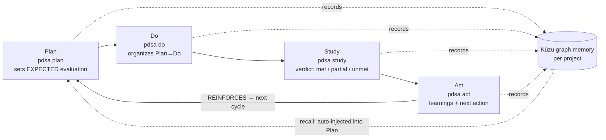

# akka-graph-loop

**English · [한국어](README-ko.md)**


## 🛠️ `pdsa` — a PDSA × graph-engineering support tool

```bash
npm i -g @webnori/pdsa      # Windows x64 · Linux x64 · macOS (Apple Silicon)
pdsa version
```

**`pdsa`** is a CLI support tool that backs Deming's **PDSA (Plan–Do–Study–Act) continuous-improvement
loop** with **graph engineering**. The *expected evaluation* you set in Plan is judged in Study by an LLM
(met / partial / unmet), and every cycle accumulates into a **per-project Kùzu graph memory** — a
"long-term memory for AI agents." 🚧 **Under active development.** The rest of this page introduces the
learning project (akka-graph-loop) this tool grew out of.

---

**A learning project that surveys the Graph features of Akka.NET Streams and learns each concept by
actually running it.**

Beyond what a linear `Source → Flow → Sink` pipeline can express — **fan-out (1→N split)** and
**fan-in (N→1 join)**, reusable **partial graphs**, and (as this repo's name suggests) the trickiest of all,
**cyclic / feedback loops (deadlock vs. liveness)** — this repo captures the core of the Akka.NET Graph
DSL through concepts, examples, tests, and visualization.

## What this project provides

- 📄 **Survey doc** — [`docs/akka-net-graph-조사.md`](docs/akka-net-graph-조사.md) (Korean)
  Graph concepts, a junction catalog, partial graphs, and 4 patterns for handling cycle deadlocks.
- 🧩 **Runnable samples** — `src/AkkaGraphLoop.Samples`
  GraphDSL basics · the full fan-in/out junction set · partial graphs · 3 solutions to cycles.
- 🎬 **TUI tutorial** — step through each graph's flow as an ASCII animation **wired to a real stream**
  (~5s per step, ESC to pause, Ctrl+C to quit).
- 🔁 **PDSA loop** — a standalone sample (`-- pdsa`) implementing Deming's Plan–Do–Study–Act loop as a real
  Akka.Streams feedback cycle. Each round is recorded live into a **Kùzu embedded graph DB** and read back with Cypher.
- 🖥️ **Graph viewer** — a **separate web project** that visualizes the recorded Kùzu graph (local port, self-contained SVG force layout, no external CDN).
- 🛠️ **pdsa-cli** — the official CLI that lets an AI agent run/record/query the PDSA loop and get LLM coaching. A **Native AOT single executable** (Akka + Kùzu bundled), shipped to npm as `@webnori/pdsa`.
- 🧪 **Tests** — `tests/AkkaGraphLoop.Tests` (xUnit + Akka TestKit) verifying each junction and cycle **liveness (no deadlock)**.

## What you learn

- Assembling non-linear graphs by wiring junctions with `GraphDsl.Builder`.
- The difference and usage of fan-out (`Broadcast`/`Balance`/`UnZip`) and fan-in (`Merge`/`MergePreferred`/`Zip`/`ZipWith`/`Concat`).
- Building reusable components with `UniformFanInShape` and `Source/Flow.FromGraph`.
- Why cycles **deadlock** under bounded buffers, and how to secure **liveness** with `MergePreferred` / `Buffer(DropHead)` / balanced `ZipWith` + initial injection.

**Stack:** `Akka.Streams` 1.5.70 · .NET 10 · xUnit / Akka.TestKit

## Build & test

```bash
dotnet build
dotnet test
```

## The `pdsa` CLI

Installed from npm (above), the CLI supports the PDSA continuous-improvement loop with a per-project graph
memory. It coaches an AI agent through Deming's cycle and **accumulates each step into a project graph DB**,
building "advanced memory for AI agents." The reusable core lives in **`AkkaGraphLoop.Core`** (PDSA engine +
Kùzu), shared by the samples, the viewer, and the CLI.

> In a dev tree you can substitute `dotnet run --project src/pdsa-cli -- <command>` for `pdsa`.

### Closed-loop cycle (expected → verdict → reinforce)



```bash
pdsa project set my-repo      # pick a project (per-project graph DB)
pdsa plan  "what & why & how" # sets a verifiable EXPECTED evaluation → starts a cycle
pdsa do    "what you did"     # organizes Plan→Do
pdsa study "results/metrics"  # LLM judges vs. expected: met | partial | unmet
pdsa act   --note "memo"      # learnings + auto-links a REINFORCE cycle if needed
pdsa status                   # progress + expectation hit-rate (recall)
pdsa eval                     # per-cycle expected / verdict / actual + hit-rate
pdsa recall "topic"           # read back prior-cycle learnings (planning context)
pdsa history                  # every cycle, oldest first: expected -> verdict -> actual -> learning
pdsa show 7                   # one cycle in full: phases, metrics, reinforcement links
pdsa view                     # local graph viewer
```

- **Plan** makes the LLM set a verifiable *expected evaluation* (success criteria / metric). Recent-cycle
  learnings are **auto-injected** into the coaching so it doesn't repeat past mistakes (`--no-recall` opts out).
- **Study** compares result vs. expected and records a **verdict** (`met`/`partial`/`unmet`) + the measured actual.
- **Act** decides whether immediate reinforcement is needed; if so, the next `pdsa plan` is automatically
  linked as a **reinforcement cycle** (`REINFORCES` edge). `--fresh` opts out.
- **Hit-rate (recall)** = expectation hit-rate (`met / cycles-with-a-verdict`), shown in `status`/`eval` and in the viewer.
- **`pdsa recall`** reads accumulated learnings back out (optionally filtered by a topic keyword) so an agent
  can pull context before planning — the same memory `plan` injects automatically.

### Structured output for agents (`--json`)

Every cycle command exposes the fields it already parsed as a single JSON object — add `--json` to
`plan` / `do` / `study` / `act` / `status` / `eval` / `recall`. The default (human-prose) output is unchanged,
so agents get stable machine-readable fields without scraping coaching text.

```bash
pdsa study "p95 320→240ms" --json
# {"project":"my-repo","cycle":7,"expected":"…","verdict":"partial","actual":"…","narrative":"…","llmEnabled":true}

pdsa status --full            # prose, without the 70/90-char truncation (status/eval)
```

### Staying up to date (`pdsa update`)

```bash
pdsa update            # check the latest version on npm and update (npm global)
pdsa update --check    # only report current vs. latest
```

Help and the no-argument screen also show a "new version available" note (24 h cached, offline-safe).
On Windows, `update` **won't force-kill** a running `pdsa` — if another instance is holding the native
`kuzu_shared.dll` (typically `pdsa view`), it asks you to close it first, then retries cleanly (avoids the npm
`EPERM … unlink kuzu_shared.dll` cleanup warning). Manual update is always `npm i -g @webnori/pdsa@latest`.

### LLM providers · auth modes

Attach the LLM used for judging/coaching in several ways. Without an LLM, inputs are still **recorded** to
the graph; only coaching/verdict is skipped.

```bash
# ① OpenAI(-compatible) API key — default
pdsa config key <key>                     # or key-file <path> (keeps the key out of config)
pdsa config model <model>                 # default: gpt-5.6-terra
pdsa config reasoning <level>             # none|low|medium|high|xhigh|max

# ② Keyless open-weight (local / compatible endpoints) — ollama · vLLM · LM Studio …
pdsa config provider local                # http://localhost:11434/v1, no auth (private ranges auto-allowed)
pdsa config provider openai-compat <URL>  # any OpenAI-compatible endpoint
pdsa config allow-insecure-no-auth true   #   explicit opt-in required to use a REMOTE endpoint with no auth

# ③ GPT OAuth (refresh token) — device-code login
pdsa config oauth device-endpoint <URL> && pdsa config oauth endpoint <token-URL> && pdsa config oauth client <id>
pdsa config login

# ④ Codex (ChatGPT subscription) — reuses the official `codex login` token  [experimental]
codex login && pdsa config auth codex

# ⑤ Claude Code (claude -p) — uses your already-logged-in Claude, no key
pdsa config auth claude-cli

pdsa check                                # verify with a real round-trip (any mode)
pdsa config show                          # current auth / model / language (key masked)
pdsa models [--filter gpt-5.6]            # list endpoint models (OpenAI-compatible)
```

Load priority: env vars (`OPENAI_API_KEY`/`OPENAI_MODEL`/`OPENAI_BASE_URL`/`OPENAI_REASONING_EFFORT`) →
global config (`{LocalAppData}/pdsa-cli/openai.json`) → repo `.secret/openai.json`.

> ⚠️ **Note on Claude Code (`claude -p`)**
> - **Check Anthropic's policy first** and use it only within the terms of your Claude Code (Claude
>   subscription) plan — i.e. **inside the Claude Code environment**.
> - `claude -p` is **not the official API path**; it invokes the agent CLI as a subprocess. It has startup
>   latency and, because of the agent's internal context, can **use tokens inefficiently** (burning
>   subscription credits faster). For bulk/automated use, prefer an official API key (①).

### Language (English / 한국어)

Show help and the recorded PDSA coaching in your preferred language. With nothing set, it **auto-detects the
OS locale** (Korean → Korean, otherwise English).

```bash
pdsa config lang en          # pin: en | ko | auto
pdsa --lang ko <command>     # this invocation only
#   or the env var: PDSA_LANG=ko
```

Priority: `--lang` > `PDSA_LANG` > `config lang` > OS locale > default `en`. The chosen language drives both
the **help text** and the **coaching text that gets recorded**.

### Multi-project (separate DB per project)

```bash
pdsa project set <name>   # persist the active project
pdsa project list         # projects + cycle counts (* = active)
pdsa project show         # active project / DB path
pdsa project clear        # unset (fall back to cwd name)
```

Graph DBs accumulate per project at `{LocalAppData}/pdsa-cli/{project}/graph.kuzu`. Resolution priority:
`--project <name>` (one-off) → active project (`set`) → current directory name.

### For AI agents

`pdsa` is designed so an agent (e.g. Claude Code) performs work **as PDSA cycles** and accumulates learning
into graph memory. This repo ships a ready-to-use Claude Code skill at `.claude/skills/pdsa/SKILL.md`:
mentioning "pdsa" in a new session triggers the Plan→Do→Study→Act flow. See [README-ko.md](README-ko.md) for
the full agent-instruction block. You can also install the skill into any workspace with `pdsa init`
(`--lang en|ko`).

## Under the hood

### Embedded graph DB: Kùzu

Recording uses **Kùzu** (an in-process embedded graph DB with Cypher — *"the SQLite/DuckDB of graph DBs"*).
There is no official NuGet, so the C API is called via P/Invoke (`Kuzu/KuzuNative.cs`) and the native
`libkuzu` (~12MB) is **downloaded automatically at build time** (`native/Kuzu.targets`, pinned to v0.11.3,
copied to the output folder for the host OS/arch). Binaries are not committed to git.

### Graph viewer (separate project, local port)

The recorded Kùzu graph is visualized by a **separate web project** (`AkkaGraphLoop.Viewer`): an ASP.NET
Core minimal API reads the DB (read-only) and serves `/api/graph` JSON, drawn by self-contained HTML
(vanilla JS + SVG force layout). It supports a project switcher, Study nodes colored by verdict
(met/partial/unmet), `REINFORCES` edges, and an expectation hit-rate badge.


```bash
dotnet run --project src/pdsa-cli -- view   # or the installed: pdsa view
```

### Native AOT build

Each platform is published on its own CI runner (host = target):

```bash
dotnet publish src/pdsa-cli -c Release -r win-x64   -p:Version=0.0.1   # Windows
dotnet publish src/pdsa-cli -c Release -r linux-x64 -p:Version=0.0.1   # Linux
dotnet publish src/pdsa-cli -c Release -r osx-arm64 -p:Version=0.0.1   # macOS (Apple Silicon)
```

- **Akka.NET + Native AOT**: passing an explicit `ConfigurationFactory.Default()` avoids the
  `ConfigurationManager` (app.config) path that crashes under AOT/single-file (see `AkkaPdsaEngine`).
- Prebuilt **Kùzu (C++) via P/Invoke** (AOT-friendly); OpenAI via `HttpClient` + source-generated JSON (AOT-safe).

### Distribution (npm)

Published as `@webnori/pdsa` with an esbuild-style **optionalDependencies** layout: the main package holds a
tiny Node launcher (`bin/pdsa.js`) and depends on three platform packages
(`@webnori/pdsa-{win32-x64,linux-x64,darwin-arm64}`) gated by `os`/`cpu`. On install, npm fetches only the
matching platform binary (no postinstall, no network beyond the package). A GitHub Actions workflow builds
all three on tag `v*` and publishes them. See `.github/workflows/release.yml` and `npm/`.

## Layout

```
src/AkkaGraphLoop.Core/     # shared library (referenced by Samples · Viewer · CLI)
  Pdsa/                      #   Deming PDSA: PdsaLoop (demo feedback cycle) · PdsaWorkflow (agent memory) · readers · paths
  Kuzu/                      #   Kùzu interop: KuzuNative (C API P/Invoke) · KuzuGraph (thin wrapper)
src/AkkaGraphLoop.Samples/  # graph learning samples + TUI tutorial (incl. -- pdsa console)
src/AkkaGraphLoop.Viewer/   # graph viewer (separate web project, local port)
src/pdsa-cli/               # official CLI `pdsa` (Native AOT): Program · Cli · Commands · Workflow · Engine · Llm
native/Kuzu.targets         # auto-downloads libkuzu at build/publish
npm/                        # npm packaging: main launcher (@webnori/pdsa) + assemble script
.github/workflows/          # release.yml — AOT build (3 platforms) → npm publish
tests/AkkaGraphLoop.Tests/  # xUnit + Akka TestKit
```

## Related reading

- **[PDSA — History, Theory, and the Quality Legacy](PDSA.md)** — why this project is built on PDSA: Shewhart
  → Deming → Japan's quality rise (Toyota, Nintendo) → the West re-learning quality, and **PDCA vs. PDSA**.
  Fact-checked. (한국어: [PDSA-ko.md](PDSA-ko.md))
