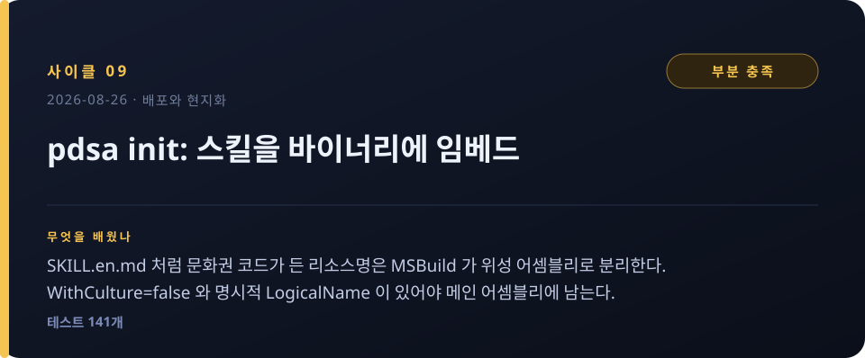
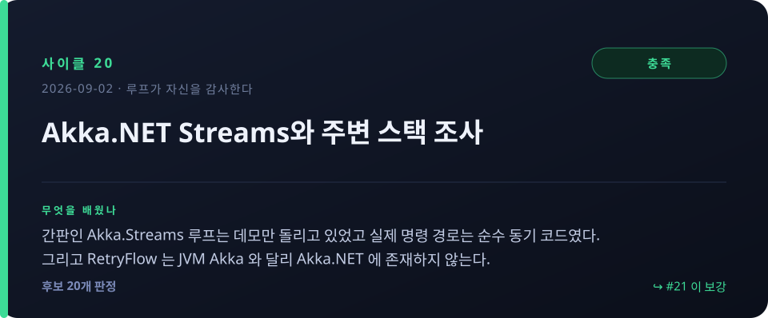
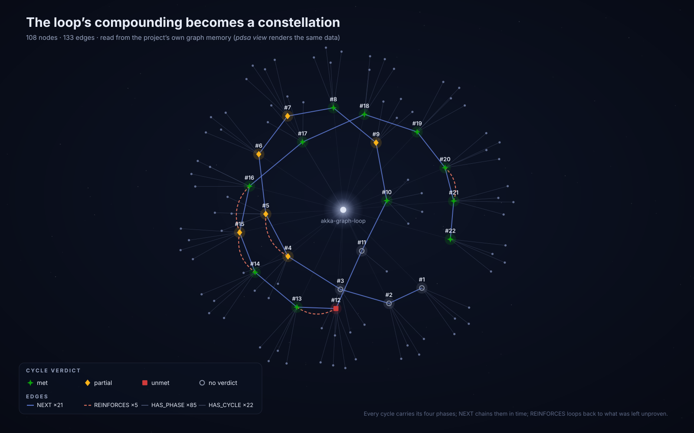

# 자기개선 루프 — 이 프로젝트를 만든 22번의 PDSA 사이클

**[English](README.md) · 한국어**

이 프로젝트는 PDSA 도구를 *만들기만* 한 게 아니다. **그 도구로 만들어졌다.** 2026-08-26 이후의 모든
변경은 `pdsa` CLI 자신의 Plan → Do → Study → Act 루프를 거쳤고, 모든 단계가 지금도 그래프에 남아 있다.

아래의 Plan/Do/Study/Act 내용은 **실제로 기록된 원문**을 읽기 좋게 줄인 것이다. 원본은 루프 자신의
메모리에서 언제든 되읽을 수 있다:

```bash
pdsa history --to 22 --full --project akka-graph-loop   # 전 회차 타임라인(오름차순)
pdsa show 21 --full --project akka-graph-loop           # 한 회차의 4단계 원문
```

> 이 두 명령은 이 문서를 시작할 때 **없었다.** 그래서 그래프 JSON을 손으로 파싱해야 했는데, 그것이야말로
> 루프가 드러내야 할 종류의 공백이라 사이클 #22가 됐다. 이 문서는 자기가 설명하는 CLI만으로 만들어진
> 첫 산출물이다.

---

## 22회가 실제로 바꾼 것

| | 사이클 1 | 사이클 22 |
|---|---|---|
| 테스트 | — | **271개** |
| 루프가 자신을 판정할 수 있나? | `expected` 필드 자체가 없음 | 회차마다 `met / partial / unmet` |
| LLM 프로바이더 | 1개 (OpenAI API 키) | **5개** (API 키 · 키리스 로컬 · GPT OAuth · Codex · `claude -p`) |
| 에이전트가 읽을 수 있는 출력 | 프로즈뿐 | 9개 명령의 `--json` |
| LLM 호출 실패가 메모리를 오염시키나? | **그렇다 — 100%** | **아니다 — 실패 주입 20회에 0건** |
| 지난 회차를 조회할 수 있나? | 불가 | `pdsa show <n>` / `pdsa history` |

**기대 충족률: 판정된 18회 중 11회(61%).** 이 숫자는 추세를 오히려 축소해 보여준다:

```
사이클 4–14 (처음 판정된 10회)   ████░░░░░░   met 4회  →  40%
사이클 15–22 (마지막 8회)        ████████░░   met 7회  →  88%
```

루프가 **자기 자신을 예측하는 능력**이 좋아졌다는 뜻이고, 작업 전에 검증 가능한 기대 평가를 쓰는 이유가
바로 그것이다.

### 기록의 모양

세 회차는 **판정이 없다.** 데이터 누락이 아니라 그 자체가 역사다. **#1–#3**은 폐루프가 생기기 전이고,
**#11**은 유일하게 중도에 버려진 회차다(계획만 있고 Study 없음). 루프는 자기 미결을 조용히 지우지 않는다.
**#12는 유일한 `unmet`** — 계획은 조사 문서를 요구했는데 수행은 코드를 냈고, Study가 그 어긋남을
성공으로 반올림하지 않았다.

다섯 회차는 **보강 사이클**(`REINFORCES` 엣지)이다:

```
#4 ← #5      #12 ← #13      #14 ← #15 ← #16      #20 ← #21
```

기록을 그대로 읽으면 한 가지가 더 보인다. **Act 가 `reinforce: yes` 를 기록한 회차는 10개인데
실제 엣지는 5개다.** 이어지지 않은 다섯은 #5–#9 로, 3기의 연속 구간이다. 자동 연결
(`PendingReinforceTarget`)은 그 시점에 이미 있었으므로 `--fresh` 로 의도적으로 끊었을 가능성이 크지만,
**`--fresh` 사용 여부는 기록되지 않아 지금은 재구성할 수 없다.** 루프가 자기 기록에서 찾아낸,
아직 닫히지 않은 관측 공백이다.

---

# 이야기

아래는 회차 요약이 아니라 **개발기**다. PDSA 기록과 깃 로그를 나란히 놓고 읽으면, 사이클 하나가
어느 커밋으로 떨어졌고 어떤 커밋은 아예 사이클 없이 나갔는지가 보인다. 원문 기록(기대 평가·판정·
실제·보강)은 각 장 끝의 접이식 블록에 그대로 넣어 뒀다.

> 시각 대조 노트: PDSA 기록은 UTC, 깃 로그는 KST(+9)다. 아래 시각은 모두 KST 로 맞췄다.

**접이식 블록에 들어 있는 것** — 루프는 단계마다 다른 속성을 남긴다. 이야기에는 녹여 넣었고,
원문 값은 각 장 끝에 그대로 뒀다.

| 단계 | 남는 속성 | 값이 있는 회차 |
|---|---|---|
| **Plan** | 계획 본문 + **기대 평가**(`expected`) — Study 가 판정할 기준 | 22 / 19 |
| **Do** | 수행 보고 | 21 |
| **Study** | **판정**(`verdict`) + **실제**(`actual`) — 기대의 짝이 되는 측정값 | 18 |
| **Act** | 다음 개선 액션 + **보강 판단**(`reinforce` = `yes:무엇을` 또는 `no`) | 18 |
| 전 단계 | **계측**(지연·시도·모델·토큰) — #21 이 만든 기능이라 그 이후에만 | 2 |

`기대 평가 → 실제 → 판정`이 한 삼각형이다. 각 단계의 LLM 코칭 서술(가설·정리·학습)은 회차당
1,000자가 넘어 싣지 않았다 — `pdsa show <n> --full` 로 원문을 볼 수 있다.

---

## 0장 · 손으로 만든 열두 개의 커밋

2026년 8월 26일 00:50, 첫 커밋은 PDSA 와 아무 상관이 없었다. `fc51b4a` — Akka.NET Streams 의
Graph DSL 을 공부하려고 만든 학습 프로젝트다. 팬인·팬아웃, 부분 그래프, 그리고 이 저장소 이름이 된
사이클(피드백 루프).

그 학습이 네 시간 만에 방향을 튼다. `abe24aa` 에서 데밍의 PDSA 루프를 **Akka.Streams 피드백
사이클로 구현한 샘플**이 붙고, `14413eb` 에서 그 회차들이 Kùzu 임베디드 그래프 DB 에 실시간으로
기록되기 시작한다. `aeb8a68` 은 그 그래프를 볼 뷰어를, `338aad3` 은 마침내 `pdsa` CLI 자체를 만든다.
`5f037a0` 에서 plan/do/study/act 네 명령이 생기고, `3126030` 이 Claude Code 스킬을 넣는다.

09:37, 열두 번째 커밋까지 전부 **사람 손으로** 만들어졌다. 도구는 완성됐지만 아직 자기 자신에게는
쓰이지 않았다.

그리고 13:07, 누군가 `pdsa plan "pdsa-cli 기본기능 검증 및 유닛테스트 보강"` 을 친다.
**사이클 #1.** 도구가 자기 자신을 향한 순간이다.

---

## 1장 · 도구가 자기를 향하다 — 그런데 판정할 수가 없다

### #1 — CLI 기본기능 검증과 유닛테스트 보강


첫 사이클은 시시하게 시작해서 꽤 아픈 것을 찾아냈다. CLI 명령들을 죽 훑고(`version`, `project`,
`check`, `status`) 그래프 기록·조회를 확인하다가, **테스트 프로젝트가 `pdsa-cli` 를 참조조차 하지
않는다**는 사실이 드러난 것이다. 테스트가 있긴 했는데 정작 CLI 코드는 한 줄도 지나가지 않고 있었다.

그런데 이 발견을 "성공"이라고 부를 수가 없었다. 비교할 기준이 없었기 때문이다. 이때의 `pdsa` 에는
`expected` 필드가 아예 없었다 — Plan 은 계획 문장을 받아 적을 뿐, 무엇을 성공으로 볼지는 묻지 않았다.
네 단계를 성실히 기록하고도 판정 칸이 비어 있는 상태로 사이클이 닫혔다.

### #2 — Cli/Llm 순수 로직을 유닛테스트로 커버


#1 의 Act 가 시킨 대로 테스트 csproj 에 `PdsaCli` 참조와 `InternalsVisibleTo` 를 넣고,
ArgUtil·CommandRouter·PdsaCoach·OpenAiConfig·PdsaProjectPaths 다섯 파일을 채웠다.

지루한 회차처럼 보이지만 이 프로젝트에서 가장 오래 이자를 낸 사이클이다. 여기서 깔린 순수 로직
테스트가 3장(인증을 세 번 갈아엎는 동안)과 4장(i18n)에서 **회귀 게이트**로 그대로 쓰였다. 이후 거의
모든 회차의 기대 평가에 "기존 N개 테스트 전부 통과"가 들어가는데, 그 N 의 출발점이 이 회차다.

### #3 — 그래프 뷰어: 활성 프로젝트 표시, 재시작 없이 전환


뷰어에 `/api/projects` 와 `/api/graph?project=` 를 붙이고, 헤더에 프로젝트명과 DB 경로를 띄우고,
드롭다운으로 재시작 없이 전환하게 만들었다. 13:57, `d3e48e7` 로 #1·#2·#3 의 결과물이 한꺼번에
푸시된다.

그리고 누적된 그래프를 처음으로 **눈으로 보게 되자** 빠진 것이 드러났다. 화면에는 사이클과 단계
노드만 떠 있었다. 기대도, 판정도, 사이클 사이의 관계도 없었다. 뷰어는 기능이 아니라 다음 개선을
보이게 만든 도구였다.

<details>
<summary>이 장의 기록 원문</summary>

- **#1** 기대 평가 없음 · 판정 없음 · 보강 없음 · → `d3e48e7`
- **#2** 기대 평가 없음 · 판정 없음 · 보강 없음 · → `d3e48e7`
- **#3** 기대 평가 없음 · 판정 없음 · 보강 없음 · → `d3e48e7`

세 회차 모두 `expected`/`verdict` 필드 자체가 존재하기 전이라 값이 비어 있다. 데이터 누락이 아니라
그 시점의 스키마다.
</details>

---

## 2장 · 루프가 닫히다 — 그리고 자기에게 `partial` 을 준다

### #4 — 폐루프: 기대평가 → 판정 → REINFORCES


14:26 에 시작한 이 사이클이 이 프로젝트의 분기점이다. `PdsaWorkflow` 에
`expected`/`verdict`/`actual`/`reinforce` 네 컬럼이 ALTER 마이그레이션으로 붙고, 사이클 사이에
`REINFORCES` 엣지가 생기고, 기대 충족률이 계산되기 시작한다. `PdsaCoach` 는 LLM 응답에서
`기대평가:`·`판정:` 같은 센티넬 줄을 파싱하게 됐고, 뷰어에는 판정 색과 충족률 뱃지가 붙었다.
14:36, `8b43943`.

이제 루프는 자기를 판정할 수 있다. 그리고 첫 판정 대상이 자기 자신이었다.

결과는 **`partial`** 이었다. 테스트 73개는 전부 통과했고 `partial → 보강 → met` 흐름도 실제로
재현됐지만, eval 재현율이 1/2(50%)에 그쳤고 "대표 10개 사이클에서 90% 이상 일치"라는 기대 평가의
후반부는 손도 대지 못했다. 기능이 도는 것과 판정이 믿을 만한 것은 다른 문제라고, 루프가 스스로
적었다.

이 정직함이 기준선이 됐다. 이후 판정된 18회 중 7회가 깔끔하지 않은 판정을 받는다. "돌아갔으니
성공"으로 넘어간 회차는 하나도 없다.

<details>
<summary>이 장의 기록 원문</summary>

- **#4** 기대: CLI·그래프뷰에서 기대평가·판정·보강 이력·재현율이 100% 연결 표시되고 대표 10개 사이클
  판정이 사전 기준과 90% 이상 일치 · 판정 **`partial`** · 실제: 테스트 73개 통과, 흐름 확인됐으나
  eval 재현율 1/2(50%), 10개 표본 평가 미완 · 보강 `yes:` 판정 재현율을 높이도록 Study 입력·판정
  기준을 구조화 · → `8b43943`
</details>

---

## 3장 · 네 사이클, 커밋 하나 — 인증을 열다

며칠간 이 프로젝트에서 가장 밀도 높은 구간이다. 08-27 새벽 01:09 부터 01:44 까지 **35분 동안 네
사이클**이 돌고, 그 결과 전부가 01:55 에 커밋 하나로 떨어진다 — `103a0c4`.

### #5 — 설계 먼저: API 키 단일 방식을 넘어선 LLM 인증


사용자 지시는 분명했다. **"도입 전 플래닝 먼저."** 그래서 이 회차는 코드를 한 줄도 쓰지 않는다.
인증·설정 계층의 모든 호출부를 grep 으로 훑어 다섯 지점을 세고(`LlmOptions`, `OpenAiClient` 생성자,
`OpenAiConfig`, `ConfigCommand`, 그리고 클라이언트를 만드는 네 곳), 거기서 하나의 결정을 내린다.

**`new OpenAiClient(LlmOptions)` 시그니처를 보존한다.**

이 결정 하나가 이후 서사 전체를 좌우한다. 인증 확장이 네 파일 안에 갇히고, 클라이언트를 만드는 네
곳은 끝까지 한 줄도 바뀌지 않는다. OAuth·Codex·`claude -p` 까지 프로바이더가 셋 더 붙는 동안에도
그 경계가 버틴다.

판정은 `partial` 이었다. 설계는 섰지만 키리스·OAuth 의 구체적 설정 예시와 명시적 승인 기준이
빠졌다는 지적이었고, Act 에서 실행 가능한 JSON 예시 4종과 측정 가능한 승인 기준 5종을 덧붙였다.

### #6 — 인증 추상화: AuthMode + IAuthProvider


설계대로 `AuthMode(ApiKey|OAuth|None)` 와 `IAuthProvider` 가 들어간다. `ApiKeyAuth`, `NoAuth`,
그리고 아직 스텁인 `OAuthAuth`. `OpenAiClient` 는 생성자에서 헤더를 한 번 고정하는 대신 요청마다
`GetHeaderAsync` 를 부르게 됐다.

여기서 재미있는 판단이 하나 나온다. 키를 없애는 김에 아무 엔드포인트나 무인증으로 붙게 하면
구멍이 생긴다. 그래서 `IsPrivateEndpoint` 가 loopback·RFC1918·fc00::·`.local` 만 자동 허용하고
**DNS 이름은 원격으로 취급**한다. 원격에 키 없이 붙으려면 명시적으로 설정해야 한다.

73→91 테스트가 통과했지만 또 `partial`. 계획했던 필드병합 테스트를 못 넣었고 OAuth 는 여전히
스텁이었다.

### #7 — 키리스 오픈웨이트 E2E와 설정 병합 테스트


이 회차에는 사고가 하나 있다.

`OpenAiConfig` 에 경로 주입 seam 을 넣고 실서버(`a1.webnori.com`, 키 불필요)로 E2E 를 돌리려던
중, .NET 의 `GetFolderPath` 가 `LOCALAPPDATA` 환경변수를 무시한다는 사실이 드러났다. 테스트가
격리된 임시 경로가 아니라 **사용자의 실제 전역 설정을 덮어썼다.** 원복했고, 재발 방지로 seam 을
먼저 세웠다.

Study 는 이것을 "테스트를 조심히 짜자"로 정리하지 않았다. **"정적 OS 경로는 통합 전에 주입 seam
이 선행돼야 한다"** 는 구조적 규칙으로 남겼다. 100개 테스트·경고 0 을 달성했지만 기대 평가가
지정한 4개 필드와 실제 검증한 필드가 달라서 또 `partial`.

### #8 — GPT OAuth: 갱신·저장·device-code 폴링


3장의 마지막이자 이 프로젝트의 **첫 `met`** 이다.

`OAuthToken`, `ITokenRefresher`, `HttpTokenRefresher`(HTTP 전송을 주입), device-code 폴링 상태머신
(지연 함수와 `now` 를 주입). `OAuthAuth` 가 스텁에서 실동작으로 바뀌어 만료(skew 30초)를 보고
갱신하고 Bearer 를 주입하고 저장까지 한다.

핵심은 **무엇을 주입 가능하게 만들었는가**다. 리프레셔·HTTP 전송·시계를 전부 밖에서 넣게 하자,
"기다려야 아는" 상태들 — 만료, 갱신, `slow_down` 백오프, 거부, 데드라인 초과 — 이 전부 결정적
단위테스트가 됐다. 102→129 테스트, 경고 0, 판정 `met`.

세 번의 `partial` 이 여기서 닫혔다. 그리고 11분 뒤 네 사이클의 결과가 커밋 하나로 나간다.

<details>
<summary>이 장의 기록 원문</summary>

- **#5** 기대: 설계 문서가 config 스키마·인증 추상화 경계·하위호환 규칙을 명시하고 키리스/OAuth 설정
  예시와 승인 기준을 포함 · 판정 **`partial`** · 실제: 설계·하위호환 회귀 5종·도입 순서 확정, 변경지점
  5/5 식별했으나 설정 예시·승인 기준 확인 안 됨 · 보강 `yes:` 미해결 쟁점 3개를 확정·승인 · → `103a0c4`
- **#6** 기대: 기존 73개 + 신규 인증 테스트 통과, ApiKey 기본 동작 유지, `provider local` 키 없이 로드,
  원격 무키는 차단 · 판정 **`partial`** · 실제: 91개 통과·키리스 로드·원격 차단 확인, 필드병합 테스트
  미추가·OAuth 스텁 · 보강 `yes:` Config 경로 주입 후 `repo<global<env` 병합 검증 · → `103a0c4`
- **#7** 기대: 91개 통과, 병합 테스트가 4개 필드별 우선순위 검증, opt-in 시 check OK·미설정 시 원격
  차단 · 판정 **`partial`** · 실제: 100개·경고 0, 차단(exit 3)과 키리스 check 성공(1,270ms) 확인,
  지정 4필드와 검증 필드 불일치 · 보강 `yes:` `allow_insecure_no_auth` global-only 정책 고정 · → `103a0c4`
- **#8** 기대: 102개 + OAuth 코어·config·device-code 테스트 통과, 경고 0, 만료/갱신/persist/전이 재현 ·
  판정 **`met`** · 실제: 129개 전량 통과·경고 0, 갱신·persist·무영향·`pending`/`slow_down`/성공 전이·
  `refresh_token` 비노출 검증 · 보강 `yes:` `refresh_token_file` 원자적 쓰기·권한 보강 · → `103a0c4`
</details>

---

## 4장 · 배포와 현지화 — 빌드가 성공해도 리소스는 사라진다

### #9 — pdsa init: 스킬을 바이너리에 임베드



`pdsa init` 은 실행한 워크스페이스에 PDSA 스킬(`.claude/skills/pdsa/SKILL.md`)을 설치하는 명령이다.
AOT 단일 파일이라 스킬 문서를 임베디드 리소스로 넣어야 했다.

여기서 비자명한 함정이 나온다. `SKILL.en.md`, `SKILL.ko.md` 라는 파일명의 `.en`/`.ko` 를 MSBuild
`AssignCulture` 가 **문화권 코드로 오인**해 두 리소스를 위성 어셈블리로 분리해 버렸다. 둘 다
`PdsaCli.Resources.SKILL.md` 라는 같은 이름으로 충돌했고, 결과적으로 **메인 dll 에는 리소스가
0개**였다. 빌드는 성공했다.

`WithCulture=false` 와 명시적 `LogicalName` 으로 문화권 추론을 꺼서 해결했다. 그리고 배운 것:
`--getItem` 결과는 임베드 성공을 보장하지 않는다. 결정적 검증은 `GetManifestResourceNames` 와
실제 로드 테스트뿐이다.

판정은 `partial` — 141개 테스트와 실 CLI E2E 는 통과했지만, AOT 네이티브 exe 로 `init` 을 실제
실행하는 검증은 로컬 링크 환경 문제로 못 했다. 06:40, `ff3b4e9`.

### #10 — 도움말·코칭·설정 전반의 i18n


`--lang > PDSA_LANG > config > OS 로케일 > en` 이라는 5단 우선순위를 세우는 회차다.

문제는 AOT 를 위해 켜 둔 `InvariantGlobalization=true` 가 `CultureInfo` 를 막는다는 것.
환경변수(`LANG`/`LC_ALL`/`LC_MESSAGES`/`LANGUAGE`)와 Windows `GetUserDefaultUILanguage` P/Invoke 로
우회했다. `LibraryImport` 가 unsafe 를 요구해 `DllImport` 로 바꾼 것도 이 회차다.

더 중요한 건 **언어 결정을 부작용 없는 `PdsaLang.Resolve` 하나로 분리**한 것이다. 덕분에 5단
우선순위 전체가 격리 단위테스트로 고정됐다. 141→163 테스트, 판정 `met`. 07:22, `7d04df5`.

<details>
<summary>이 장의 기록 원문</summary>

- **#9** 기대: AOT publish 산출물에서 `pdsa init --lang en|ko --yes` 가 유효한 `SKILL.md` 생성, 기존
  102+ 및 신규 리소스·경로·덮어쓰기 테스트 통과, 경고 0 · 판정 **`partial`** · 실제: 141개·신규 12개·
  실 CLI E2E·경고 0 달성, AOT 네이티브 exe 검증은 링크 환경 문제로 미완 · 보강 `yes:` 정상 링크 환경
  또는 CI 에서 네이티브 exe 로 검증 · → `ff3b4e9`
- **#10** 기대: 기존 141개 + i18n 우선순위·한국어 감지·프롬프트·도움말 테스트 통과, 경고 0, 5단
  우선순위가 각 격리 시나리오에서 재현 · 판정 **`met`** · 실제: 163개 전량 통과·경고 0, 우선순위와
  ko/en 분기가 테스트·실 CLI 에서 확인 · 보강 `no` · → `7d04df5`
</details>

---

## 5장 · 에이전트가 자기 모델을 쓰게 하라 — 유일한 실패와 유일한 포기

이 장은 이 프로젝트에서 유일하게 **버려진 사이클**과 유일한 **`unmet`** 이 나오는 구간이다.

### #11 — Codex OAuth 모드 (`~/.codex/auth.json` 재사용)


07:37 에 Plan 이 기록된다. Codex 구독 사용자가 공식 `codex login` 산출물을 그대로 재사용해 `pdsa`
를 쓰게 하자는 계획이었고, 토큰 소스부터 갱신 엔드포인트, JWT 에서 `account_id` 를 꺼내는 방법,
`/responses` SSE 까지 메커니즘이 상세히 적혀 있다.

그리고 Do 가 없다. Study 도 Act 도 없다.

22회 중 유일하게 중도에 끊긴 회차다. 지금도 `status` 가 `acted` 가 아니라 **`planned`** 로 남아
있다. 루프는 자기 미결을 조용히 지우지 않는다.

**그런데 코드는 나갔다.** 07:47 의 `a2a1aaf` — "Codex (ChatGPT subscription) OAuth mode
[experimental]" — 가 정확히 이 계획의 구현이다. 사이클은 버려졌지만 작업은 살아서 커밋이 됐다.
기록과 저장소를 나란히 놓아야만 보이는 종류의 사실이다.

### #12 — 공식 셀프모델 연동 경로 조사


6분 뒤 시작된 이 회차의 Plan 은 분명했다. Claude Code 같은 에이전트가 **공식 기능**으로 자기 모델을
쓰게 하는 경로(MCP sampling / `claude -p` / Agent SDK)를 조사한다. 프롬프트 주입 편법은 지양한다.
그리고 결정적으로: **"이번 세션은 구현 없이 자료조사만."** 기대 평가도 그에 맞춰 `docs/` 의 설계
문서와 비교표, 근거 URL, 채택 후보 판정을 요구했다.

Do 에 적힌 것은 Codex OAuth 구현이었다. 단위 테스트 12개, 전체 175개 통과, 설정 스모크 확인.

좋은 작업이다. 그런데 계획한 것이 아니었다.

Study 는 이것을 성공으로 반올림하지 않았다. **`unmet`** — 22회 중 유일하다. "기대한 `docs/` 설계
문서·비교표·근거 URL·채택 후보 판정의 산출물은 제시되지 않았다."

판정을 **산출물이 아니라 기대에 맞춰** 내린 결과다. 그리고 그래서 다음 회차가 존재할 수 있었다.

### #13 — 프로바이더 조사·설계 문서 작성


#12 가 못 낸 것을 낸다. 병렬 서브에이전트 둘로 (a) pdsa 의 LLM 프로바이더 아키텍처 맵과
(b) Claude Code 공식 메커니즘 조사를 동시에 돌리고, 결과를 두 문서로 묶었다 —
`claude-code-self-llm-조사.md`(4후보 비교표 + 근거 URL)와
`claude-code-provider-설계.md`(삽입점 6곳 + 팩토리 우회 함정 + 미결 5건).

4개 후보를 비용·성능·연동·AOT·안정성·즉시 실현성으로 비교해 **D 조건부채택(ToS 선결), B 폴백,
A 기각, C 비권장**으로 판정했다. 구현은 없다 — plan-first 원칙. 판정 `met`.

같은 주제를 문서를 기대 평가로 걸고 다시 돌리자 한 번에 통과했다. 차이는 무엇을 만들지가 아니라
**무엇으로 성공을 판정할지**였다.

### #14 — `claude -p` 를 LLM 프로바이더로 채택


설계의 폴백 P2 를 정식 채택한다. `ClaudeCli.cs` 가 실행파일을 해석하고(env > config > PATH),
`ClaudeCliClient` 가 `claude -p --output-format json --max-turns 1 --append-system-prompt` 를
`ArgumentList` 로 넘긴다(이스케이프 걱정 없음).

175→189 테스트, 경고 0, 그리고 실제 `claude -p` 왕복에서 `result=OK`. 판정 `met`.

편법이 필요 없었다. 공식 헤드리스 CLI 하나로 키도 과금도 없이 "에이전트가 자기 모델을 쓴다"가
성립했다. 다만 왕복이 **7,411ms** 였고, Act 는 그것을 그냥 넘기지 않았다 — 보강 `yes:` "시작지연
약 7.4초에 대한 사용자 피드백·타임아웃 정책을 즉시 보강". 그 숫자가 네 회차 뒤 #18 의 계획이 된다.

08:51, `f0a2eb0`. #13 의 문서 두 개와 #14 의 구현이 한 커밋에 같이 실렸다.

<details>
<summary>이 장의 기록 원문</summary>

- **#11** 기대: 기존 163개 + Codex 단위 테스트 통과, 경고 0, 사용자가 실제 `auth.json` 으로 로그인·
  갱신·SSE 1회 이상 확인 · **판정·실제·보강 기록 없음**(사이클 상태 `planned`) · 계획의 구현은 → `a2a1aaf`
- **#12** 기대: `docs/` 에 경로별 지원 여부·인증·제약·난이도·근거 URL 을 담은 설계 문서 1개 이상과
  비교표 1개 이상, 채택 후보 1개 명시 · 판정 **`unmet`** · 실제: 구현·테스트 12개·175개 통과·스모크는
  확인, 기대한 문서·비교표·근거 URL·채택 판정은 미제시 · 보강 `yes:` Codex 사용자가 실 E2E 1회 수행 ·
  → `a2a1aaf`
- **#13** 기대: 조사·설계 문서가 `docs/` 에 작성되고 최소 3개 프로바이더를 비용·성능·호환성·보안으로
  비교해 채택/보류/제외 판정 명시 · 판정 **`met`** · 실제: 문서 2개 작성, 4개 후보를 6기준으로 비교해
  D 조건부채택·B 폴백·A 기각·C 비권장 명시 · 보강 `no` · → `f0a2eb0`
- **#14** 기대: 기존 175개 + ClaudeCli 테스트 통과, 경고 0, `config auth claude-cli` 후 실제 `claude -p`
  1회에서 성공 `result` 수신·PDSA 태그 추출 · 판정 **`met`** · 실제: 189개·신규 14개 통과·경고 0,
  실 왕복 7,411ms 에서 `result=OK`·태그 추출 검증 · 보강 `yes:` 시작지연 7.4초에 대한 피드백·타임아웃 ·
  → `f0a2eb0`
</details>

---

## 6장 · 써 봐야 나오는 결함들

### #15 — 멀티프로젝트: 모든 명령에 `--project`


Plan 문장 자체가 결함 신고서다. "`--project` 인자를 주면 독립 실행되게 한다. **현재
`ArgUtil.Positional` 이 옵션 '값'까지 본문에 합쳐 기록을 오염시켜 이 기능이 실제로는 깨져 있다.**"

`Positional` 은 `-` 로 시작하지 않는 토큰을 전부 본문으로 모았다. 그래서
`pdsa plan "캐시 도입" --project myrepo` 를 치면 기록 본문에 `myrepo` 가 섞여 들어갔다. 문서에는
있는 기능이 조용히 깨져 있었고, 이건 **실제로 써 봐야만** 드러난다.

고친 방법은 값-옵션 화이트리스트다. `--expect`, `--project`, `--note` 등 11개 옵션 뒤의 토큰을
건너뛰게 하자 plan·do·study·guide 가 한꺼번에 해결됐다.

판정은 `partial`. 두 프로젝트에서 `plan --project` 동시 실행은 실증했지만 do/study/act 까지 포함한
전체 체인은 안 해 봤기 때문이다. Act 는 "구조상 동일 보장"이라는 자기 논증을 근거로 인정하지 않고
실증을 요구했다.

### #16 — 보강: #15 가 실증하지 못한 갭을 닫는다


8분 뒤 시작된 보강 사이클이다. 폐기용 프로젝트 둘(`zz-fc-a`, `zz-fc-b`)에 plan→do→study→act
전체 체인을 `--project` 로 **동시에** 돌리고(bash 백그라운드 + wait), 각 프로젝트 status 의 phase
라인을 grep 해 프로젝트명 토큰이 나오는지 봤다.

**8개 단계 기록 전부에서 0회.** 병렬 실행 충돌도 0건. 판정 `met`. 검증 후 폐기용 DB 는 지웠다.

#15 는 코드를 다 고쳤고 논리도 옳았다. #16 이 추가로 한 일은 **오직 실증**이다. 이것이
`partial → 보강 → met` 이 설계된 이유다 — 증명되지 않은 주장을 성공으로 반올림하지 않되, 폐기하지도
않고 다음 회차에서 값싸게 닫는다. 14:13, `a69e910` 하나에 #15 와 #16 이 같이 실렸다.

### #17 — AOT 단일 실행파일을 위한 인프로세스 뷰어


개발 트리에서는 완벽히 돌던 `pdsa view` 가 npm 설치본에서만 "뷰어를 찾지 못했습니다"로 실패했다.
원인은 단순했다 — 별도 `AkkaGraphLoop.Viewer` exe 를 프로세스로 띄우는 구조였는데, AOT 단일
실행파일 배포에는 그 exe 가 없다.

`ViewerHtml` 을 Core 로 옮겨 공유하고, CLI 안에 `System.Net.HttpListener` 로 localhost 서버를
직접 띄웠다. JSON 은 STJ 소스젠 컨텍스트로 AOT-안전하게 직렬화. AOT 단일 `pdsa.exe`(40MB)에서
세 라우트가 모두 200 을 반환하고 194개 테스트가 통과했다. 판정 `met`.

배운 것은 배포 형태가 설계 제약을 만든다는 것이다. AOT 단일 파일을 고른 순간 **외부 실행파일 의존은
전부 부채**가 된다. 리플렉션 직렬화도 같은 이유로 못 쓴다.

### #18 — Claude CLI 프로바이더의 타임아웃과 스피너


#14 에서 측정된 7.4초가 이틀 뒤 계획이 됐다. 타임아웃이 없으니 hang 위험이 있고, 조용한 대기는
정지처럼 보인다.

`ResolveTimeout()` 과 순수 함수 `ParseTimeout`(env > config > 180초), 링크드 CTS 로 감싸 내부
토큰이 발화했을 때만 `TimeoutException`(조정 안내 포함), 취소 시 `Kill(entireProcessTree)`.
그리고 `Cli/Spinner.cs` 를 코칭 호출 여섯 곳에 둘렀다.

여기서 같이 검증한 것이 중요하다. 스피너는 **stderr** 로 나가고 리다이렉트 시 아무것도 하지 않는다.
그래서 **리다이렉트된 stdout 의 제어문자가 0건**임을 테스트로 고정했다. UX 개선이 에이전트가 읽는
출력을 오염시키면 안 된다는 제약을, 기능과 같은 회차에서 못 박았다. 판정 `met`. 22:49, `276eded`.

<details>
<summary>이 장의 기록 원문</summary>

- **#15** 기대: 두 프로젝트에서 `--project` 로 p/d/s/a 동시 실행 시 기록 본문에 옵션값 미포함, 모든
  레코드가 지정 DB 에만 저장, 테스트 100% 통과 · 판정 **`partial`** · 실제: `plan --project` 동시 실행
  오염 0회·DB 분리·191개 통과, 전체 체인 동시 실행은 미수행 · 보강 `yes:` 전체 체인을 실제 병렬 실행해
  종단간 검증 · → `a69e910`
- **#16** 기대: 동시 E2E 후 4단계 기록 생성, 프로젝트명 옵션값 미노출, 각 기록이 해당 DB 에만 저장됨을
  grep·DB 조회로 100% 확인 · 판정 **`met`** · 실제: 4단계 생성, 8개 phase 입력의 자기·상대 프로젝트명
  grep 0회, 병렬 충돌 0건 · 보강 `no` · → `a69e910`
- **#17** 기대: AOT 단일 파일에서 별도 exe 없이 localhost 기동, 3개 라우트 200·camelCase 계약, 전체
  테스트 통과 · 판정 **`met`** · 실제: 단일 `pdsa.exe`(40MB)에서 기동, 3라우트 200·계약 충족, 194개
  통과 · 보강 `no` · → `e3cf27b`
- **#18** 기대: 우선순위(env > config > 180s) 테스트 검증, 타임아웃 시 프로세스 종료, TTY 스피너 표시,
  리다이렉트 stdout 스피너 출력 0건 · 판정 **`met`** · 실제: Theory 5케이스 + E2E(env=1s 가 config=90s
  오버라이드), 1,175ms 타임아웃·kill·안내, TTY 스피너·리다이렉트 제어문자 0건 · 보강 `no` · → `276eded`
</details>

---

## 7장 · 메모리가 복리로 돌기 시작한다

### #19 — 구조화 `--json` 출력, recall, `--full`


이 회차가 이 프로젝트의 두 번째 분기점이다.

세 가지를 한다. (1) 일곱 명령에 `--json` 옵트인 구조화 출력 — 에이전트가 한국어 코칭 프로즈를
정규식으로 긁지 않게 하는 계약이다. 소스젠 camelCase 로 AOT-안전하게. (2) `PdsaWorkflow.RecentLearnings`
와 `PdsaCoach.HypothesisAsync` 의 `[과거학습]` 블록을 연결해, `plan` 이 최근 세 사이클의 학습을
**자동으로** 코칭 프롬프트에 주입한다. (3) `status/eval --full` 로 절삭 해제.

(2)가 결정적이다. 그 전까지 그래프는 **보관소**였다. 사이클이 쌓여도 다음 계획은 그걸 읽지 않았다.
`recall` 이 붙은 뒤로 잔별 85개가 다음 Plan 의 입력이 된다. 이 문서 앞부분의 "복리"는 정확히 이
지점부터 시작된 이야기다.

204→213 테스트, 프로즈 회귀 없음, 판정 `met`. 그리고 17:13 `f7bcef8` 이 브랜치로 나가
**PR #1** 이 열린다. 이 저장소의 첫 PR 이다 — 그 전까지는 전부 main 직행이었다.

<details>
<summary>이 장의 기록 원문</summary>

- **#19** 기대: 7개 명령 `--json` 이 camelCase 스키마·AOT 소스젠으로 검증, `recall` 학습이 `plan` 코칭에
  자동 반영, `status/eval --full` 무절삭, 전체 테스트 통과 · 판정 **`met`** · 실제: 7개 명령 유효 JSON,
  소스젠·recall→plan 주입·무절삭·213건(204+9) 통과·프로즈 회귀 없음 · 보강 `no` ·
  → `f7bcef8` (PR #1)
</details>

---

## 8장 · 루프가 자기 자신을 감사하다

사흘의 공백 뒤, 마지막 세 사이클은 도구가 **자기 자신을 조사 대상으로 삼는** 구간이다.

### #20 — Akka.NET Streams와 주변 스택 조사



Akka.NET Streams 의 미사용 스펙과 주변 스택(OpenTelemetry, Polly 등)을 안전성·효율성·도입비용·
도입후체크 4관점으로 훑는 조사 회차다. 그런데 조사가 세 가지를 파냈다.

**첫째, 간판이 놀고 있었다.** `IPdsaEngine` 참조를 세어 보니 `RunCommand.cs:13` 단 한 곳이었다.
이 저장소 이름이자 간판인 Akka.Streams 피드백 사이클은 **데모(`pdsa run`)에서만** 돌고 있었고,
사용자가 실제로 도는 `plan/do/study/act` 경로는 순수 동기 Kùzu 호출이었다. 그래서 "Akka 스펙을 더
영입하자"는 질문이 "수명 0.2~3초 CLI 에 ActorSystem 을 들일 값어치가 있는가"로 환원됐고, 답은
아니오였다.

**둘째, `RetryFlow` 는 존재하지 않았다.** nuget 의 Akka.Streams XML 문서를 직접 검색하니
`RestartFlow`(7건), `KillSwitches`(12건), `Supervision`(113건) 은 있는데 `RetryFlow` 는 **0건**.
JVM Akka 에는 있지만 .NET 포트에는 없다. 기억이 아니라 검색으로 확인해야 하는 종류의 사실이다.

**셋째, 실패 주입이 데이터 무결성 결함을 재현했다.** 폐기용 프로젝트에 LLM 실패를 강제로 넣자
Phase 0개짜리 **고아 사이클**이 남았다(2/2, 100%). 원인은 `PlanCommand` 가 LLM 호출 **전에**
`StartCycle` 을 커밋하는 쓰기 순서였다. 더 나쁜 건 2차 피해였다 — 그 고아를 다음 `do` 가 조용히
집어와 "Plan: 입력 없음" 상태로 코칭이 진행됐고, 기대 평가가 비어 Study 가 판정할 수 없게 되고,
그것이 기대 충족률의 분모와 `recall` 품질까지 오염시켰다.

일시적 네트워크 오류 하나가 장기 메모리를 훼손하는 경로였다. 판정 `met`, 01:10 `80e25ec`.

### #21 — 원자성, 제한적 재시도, 단계별 계측


#20 이 뽑은 now 3건을 **의존성 추가 0** 으로 구현한다. 그런데 이 회차의 핵심은 무엇을 넣었느냐가
아니라 **어떤 순서로 넣었느냐**다.

자연스러운 순서는 "재시도부터"였다. 그게 정확히 틀린 순서였다. 재시도는 실패 **시도** 횟수를 늘리는데,
실패 하나마다 고아 사이클이 남는 구조에서 재시도를 먼저 넣으면 그래프 오염만 증폭된다. 그래서
원자성(N1)이 먼저다.

`KuzuGraph.BeginTransaction` 을 만들기 전에 **C API 에서 트랜잭션이 실제로 되는지 테스트 4개로 먼저
확인**했다. 통과했고, 그래서 준비해 뒀던 보상 삭제 폴백이 불필요해졌다 — 불확실성을 코드가 아니라
테스트로 먼저 해소하니 설계가 단순해졌다. `StartCycleWithPlan` 이 Cycle·엣지·Plan Phase 를 한
트랜잭션으로 묶고, Do/Study/Act 는 Plan 없는 사이클을 거부한다.

재시도는 429/5xx/소켓/타임아웃만, 최대 2회, 지수 백오프 + 지터. 4xx 와 취소는 즉시 전파.
그리고 `check` 는 재시도 0 — 진단 명령이 재시도로 장애를 가리면 안 되니까.

계측은 기존 ALTER 마이그레이션 패턴을 그대로 재사용해 다섯 컬럼을 붙였고, `ILlmClient` 시그니처는
건드리지 않은 채 선택적 `ILlmUsageReporter` 로 토큰을 모았다.

**결과: 실패 주입 20회에 고아 0건**(기준선 100%), 259개 테스트, AOT 39MB 동일. 판정 `met`.

그리고 이 회차의 Study 코칭이 **자기 자신의 계측치**(`latencyMs=22179`, 토큰 1286/1443)를 판정
근거로 인용했다. 계측이 기록에 그치지 않고 판정에 되먹여진다는 것이 그 자리에서 실증됐다.

부수적으로 하나 더. 콜드스타트 A/B 에서 존재하지 않는 45% 개선이 나왔는데, 추적해 보니 npm 셸
래퍼가 기준선에 ~190ms 를 더하고 있었다. 그 수치는 유지되지 않고 기록에서 수정됐다 —
**측정 도구도 시스템의 일부다.**

### #22 — `history` 와 `show`: 루프 자신의 과거를 조회한다


마지막 사이클은 **이 문서를 쓰다가** 나왔다.

22회의 개선 서사를 정리하려는데, CLI 로는 그 데이터를 꺼낼 수가 없었다. `status` 는 최근순 덤프고,
`eval` 은 기대·판정·실제만, `recall` 은 학습만 준다. 특정 회차를 지정할 수도, 시간순으로 읽을 수도,
범위를 자를 수도 없었고 `REINFORCES` 는 뷰어 그래프에서만 보였다. 결국 그래프 JSON 을 손으로
파싱해야 했다.

그것이야말로 루프가 드러내야 할 종류의 공백이라 사이클이 됐다. `pdsa history`(오름차순 타임라인)와
`pdsa show <n>`(한 회차 상세 + 계측 + 양방향 보강 링크).

구현에서 한 판단이 남는다. Core 에 `Cycle(id)`·`Range(from,to,asc,limit)`·`ReinforceLinks(id)` 를
추가하면서 **private `Fetch()` 하나를 단일 조회 경로**로 만들고 기존 `Recent()` 를 그 위에 재구현했다.
명령마다 다른 쿼리를 두지 않으니 조회 방식 간 값이 어긋날 수 없고, 세 API 가 같은 사이클에 같은 값을
내는지 검증하는 구조 테스트를 넣었다. 명령이 늘어도 불일치가 **구조적으로 불가능**해진다.

271개 테스트 통과, 판정 `met`. 그리고 이 문서의 서사가 CLI 출력만으로 추출됐다 — 내부 JSON 직접
파싱 0회(기준선 1회).

<details>
<summary>이 장의 기록 원문</summary>

- **#20** 기대: 조사 대상 100%에 사용 근거·4관점 평가·검증 방법·now/next/later/reject 판정을 담은
  `docs/` 문서 작성, now 후보 1개 이상의 성공 지표 정량 정의 · 판정 **`met`** · 실제: 20개 후보 100%에
  근거·평가·방법·판정 기록, now 후보 정량 지표 5개 정의 · 보강 `yes:` LLM 성공 검증 후에만 사이클을
  생성하도록 `PlanCommand` 쓰기 순서 원자화 · → `80e25ec`
- **#21** 기대: 실패 주입 20회에 고아 0건, 재시도 대상만 최대 2회, 신규 사이클 Study 입력에 계측 포함,
  테스트·콜드스타트·바이너리 회귀 없음 · 판정 **`met`** · 실제: 고아 0건, 재시도 정책 고정, 계측 기록·
  주입 확인, 259개·39MB+13MB·229~237ms 회귀 없음 · 보강 `no` · 계측: do 22,179ms · study 11,063ms ·
  act 4,175ms · → `a2fbf08`, `d4c882d` (PR #4)
- **#22** 기대: 21회 실DB 에서 `show`·`history` 가 기대→판정→실제→배운점·계측·REINFORCES 를 정확히
  반환, 범위·정렬·JSON·구 스키마 호환·전체 테스트 통과, CLI 출력만으로 서사 작성 가능 ·
  판정 **`met`** · 실제: 21회 오름차순 반환, 양방향 REINFORCES, 경계값·구 스키마 호환, 271개 통과,
  CLI 만으로 서사 추출 · 보강 `no` · 계측: plan 6,659ms · do 19,233ms · study 9,003ms · act 4,990ms ·
  → `d750894`, `f0e42cc` (PR #4)
</details>

---

## 막간 · 루프를 타지 않은 커밋들

정직하게 적어 둘 것이 하나 있다. **모든 커밋이 사이클을 거친 것은 아니다.**

22개 사이클은 12개 커밋으로 떨어졌다. 그 사이 사이클 없이 나간 커밋이 열넷쯤 된다:

| 커밋 | 무엇 |
|---|---|
| `0f69455` | npm 배포 CI (AOT 3플랫폼) |
| `9559421` `8b11f89` `fbcc4c0` | README 영문화·히어로 이미지 |
| `493a386` | PDSA 역사·이론 에세이 |
| `f16eccb` | 뷰어를 알파 쿨링으로 안정화 |
| `8be1413` | CI 액션 Node 24 승격 |
| `d42a710` `e25f9a0` `a863721` | Astro 제품 사이트 |
| `743ab0a` | Windows CP949 → UTF-8 강제 (PR #2) |
| `553ba12` | `update` 명령 + 버전 안내 (PR #3) |
| `8271179` `0feb30b` | 문서 갱신 |

패턴이 보인다. **불확실한 일에는 루프를 썼고, 확실한 일에는 쓰지 않았다.** 인증 확장, 셀프모델
프로바이더, 원자성 결함 — 무엇이 성공인지 미리 못 박아야 했던 작업들은 전부 사이클을 탔다.
CI 버전 올리기나 오타 수정처럼 결과가 자명한 일은 그냥 커밋했다.

이것을 루프의 실패로 볼 필요는 없다. 오히려 **PDSA 를 어디에 쓸지 자체가 이 프로젝트가 학습한
것**이다.

---

## 22회를 관통하는 다섯 가지

**1. 기대 평가를 먼저 쓰는 것이 개선을 측정 가능하게 만든다.**
사이클 1–3은 실제 작업을 했지만 성공 여부를 판별할 방법을 남기지 않았다. 판정 필드가 "우리는 일을 했다"를
"18번 예측해서 11번 맞혔다"로 바꿔 놓았다.

**2. 쓸모 있는 판정은 `partial`이다.** 판정된 18회 중 7회가 깔끔한 성공이 아니었다(`partial` 6, `unmet` 1).
각각이 증명되지 않은 주장을 구체적으로 지목했고, 그중 셋(#4·#12·#15)은 조용히 잊히는 대신 명시적 보강
사이클로 닫혔다.

**3. 도그푸딩은 설계 리뷰가 놓치는 것을 찾는다.** #21의 고아 사이클 결함과 #22의 조회 명령 부재는 둘 다
코드를 읽어서가 아니라 도구를 *써서* 나왔다. #15의 파싱 결함도 마찬가지다.

**4. 개별 수정보다 순서가 중요하다.** #21의 핵심 발견은 "재시도를 넣자"가 아니라 "원자성 없이 재시도를 넣지
말라"였다. #7의 "통합 테스트 전에 경로 seam 먼저"도 같은 형태의 교훈이다.

**5. 측정 도구도 시스템의 일부다.** #21의 콜드스타트 비교는 존재하지 않는 45% 개선을 보여줬다. npm 셸 래퍼가
기준선에 ~190ms를 더하고 있었기 때문이다. 그 수치는 유지되지 않고 기록에서 수정됐다.

---

## 원본 기록 직접 읽기

여기 있는 내용은 믿어야 하는 요약이 아니다. 모든 회차를 직접 조회할 수 있다:

```bash
pdsa history --project akka-graph-loop                # 타임라인(오름차순)
pdsa history --from 15 --to 16 --full                 # 보강 한 쌍, 절삭 없이
pdsa show 21 --full                                   # 한 회차의 4단계·계측·링크
pdsa history --json | jq '.cycles[] | {id, verdict}'  # 기계 판독
pdsa view                                             # 그래프 자체를 브라우저로
```

카드는 같은 기록에서 [`cards/_generate.py`](cards/_generate.py)로 생성된다
(영문 `cards/`, 한글 `cards-ko/`).

---

# 루프의 복리가 별자리가 된다

22회를 돌고 나면 이 프로젝트의 기억은 문서가 아니라 **형태**를 갖는다. 아래는 비유가 아니라
그래프 그 자체다 — 별 하나하나가 노드, 선 하나하나가 엣지이고, `pdsa view` 가 브라우저에서
렌더하는 것과 **같은 데이터**를 같은 힘기반(force-directed) 배치로 그렸다.



## 이 별자리를 읽는 법

| 보이는 것 | 그래프에서의 정체 | 개수 |
|---|---|---|
| 중앙의 밝은 핵 | `Project` 노드 — 모든 기억의 원점 | 1 |
| 핵에서 뻗는 아주 흐린 실 | `HAS_CYCLE` — 프로젝트가 각 사이클을 소유 | 22 |
| 고리를 이루는 굵은 선 | **`NEXT`** — 사이클을 시간순으로 잇는 **척추** | 21 |
| 큰 별 (모양·색이 판정) | `Cycle` 노드 22개 | 22 |
| 큰 별 주위의 잔별 무리 | `Phase` — 회차마다의 Plan·Do·Study·Act | 85 |
| 잔별로 가는 가는 선 | `HAS_PHASE` | 85 |
| 되돌아가는 주황 점선 호 | **`REINFORCES`** — 닫히지 않은 갭으로 되돌아가는 고리 | 5 |

합계 **노드 108 · 엣지 133.** 사이클당 별 하나에 잔별 넷이 붙고, 그 별들이 `NEXT` 로 꿰여
고리가 되고, 그 고리를 `REINFORCES` 가 가로질러 되돌아간다.

## 왜 이 모양이 '복리'인가

선형 기록이라면 이 그림은 **직선**이어야 한다. 회차 22개가 일렬로 늘어선 점선.
실제로 나온 모양이 그렇지 않은 이유는 세 가지다.

**1. 각 사이클이 자기 안에 4단계를 품는다.** 회차 하나가 점이 아니라 **성단**이다.
85개의 잔별은 나중에 `recall` 이 되읽는 재료이고, 문서의 회차별 P/D/S/A 가 바로 이 잔별들이다.

**2. `REINFORCES` 가 시간을 거슬러 간다.** 다섯 개의 주황 호는 유일하게 **뒤로 가는 엣지**다.
`#15 → #16` 은 실증되지 않은 주장을 다음 회차가 증명하러 간 자국이고, `#12 → #13` 은 유일한
`unmet` 을 갚으러 간 자국이다. 이 호가 없으면 그래프는 그냥 사슬이고, 있어서 **그물**이 된다.

**3. 중심의 핵이 모든 것을 붙잡고 있다.** 22개의 흐린 실은 이 기억이 프로젝트 단위로 격리돼
있음을 보여준다. 다른 프로젝트를 돌리면 완전히 다른 별자리가 자기 DB 안에 따로 생긴다.

복리란 결국 **나중 것이 앞선 것을 입력으로 쓴다**는 뜻이고, 그래프에서 그것은 두 종류의 되먹임으로
나타난다. `REINFORCES`(되돌아가는 호)는 #5 부터 있었지만 **사람이 판단해 잇는 굵은 되먹임**이고,
#19 가 붙인 `recall` 은 잔별 85개를 다음 Plan 코칭에 **자동으로** 먹이는 가는 되먹임이다.
#19 이전까지 잔별들은 보관소였고, 그 이후 입력이 됐다.

## 별자리에서 바로 읽히는 것들

- **왼쪽 아래 붉은 사각형 하나** — `unmet` 은 22회 중 #12 단 하나다. 그리고 바로 옆 #13 으로
  주황 호가 이어져 있다. 실패가 방치되지 않았다는 것이 형태로 남았다.
- **고리 안쪽의 빈 고리들** — `#1`·`#2`·`#3`·`#11` 은 속이 빈 원이다. 판정이 없는 회차,
  즉 폐루프 이전과 중도 포기가 색이 아니라 **모양**으로 구분된다.
- **주황 호가 모두 고리의 한쪽에 몰려 있다** — 보강은 3기·5기·6기·8기에서 일어났고,
  4기(#9·#10)와 7기(#19)에는 없다. 한 번에 닫힌 구간과 두 번 걸린 구간이 눈에 보인다.

> 이 그림을 직접 돌려보려면 `pdsa view` — 같은 그래프가 브라우저에서 끌어볼 수 있는 상태로 열린다.
> 이미지는 [`constellation/_generate.py`](constellation/_generate.py) 가
> [`graph-snapshot.json`](constellation/graph-snapshot.json)(뷰어 API 응답 그대로)에서 생성한다.
