# The Self-Improving Loop — 22 PDSA cycles on this project

**English · [한국어](README-ko.md)**

This project did not just *build* a PDSA tool. It was **built by one** — every change since
2026-08-26 went through the `pdsa` CLI's own Plan → Do → Study → Act loop, and every step is still
in the graph.

The Plan/Do/Study/Act text below is the **actual recorded content**, condensed for reading and
translated from the Korean original. The raw record is always available from the loop's own memory:

```bash
pdsa history --to 22 --full --project akka-graph-loop   # the whole timeline, oldest first
pdsa show 21 --full --project akka-graph-loop           # one cycle's four phases, verbatim
```

> Those two commands did not exist when this page was started. Writing it meant hand-parsing the
> graph JSON, which is exactly the kind of gap the loop is supposed to surface — so it became
> cycle #22. This document is the first artifact produced *entirely* through the CLI it describes.

---

## What 22 cycles actually changed

| | Cycle 1 | Cycle 22 |
|---|---|---|
| Tests | — | **271** |
| Could the loop judge itself? | no `expected` field existed | `met / partial / unmet` per cycle |
| LLM providers | 1 (OpenAI API key) | **5** (API key · keyless local · GPT OAuth · Codex · `claude -p`) |
| Agent-readable output | prose only | `--json` on 9 commands |
| Does a failed LLM call corrupt memory? | **yes — 100% of the time** | **no — 0/20 injected failures** |
| Can you query a past cycle? | no | `pdsa show <n>` / `pdsa history` |

**Expectation hit rate: 11 / 18 judged cycles (61%).** That number understates the trend:

```
cycles 4–14 (first 10 judged)    ████░░░░░░   4 met  →  40%
cycles 15–22 (last 8 judged)     ████████░░   7 met  →  88%
```

The loop got better at *predicting itself*, which is the actual point of writing a verifiable
expected outcome before doing the work.

### The shape of the record

Three cycles produced **no verdict**, and that is history rather than missing data. **#1–#3** ran
before the closed loop existed; **#11** is the only cycle ever abandoned mid-flight (planned, never
studied). The loop does not quietly delete its own loose ends. **#12 is the only `unmet`** — the plan
asked for research documents, the work delivered code, and Study refused to round that up to success.

Five cycles are **reinforcement cycles** (`REINFORCES` edges):

```
#4 ← #5      #12 ← #13      #14 ← #15 ← #16      #20 ← #21
```

Reading the record straight surfaces one more thing. **Ten cycles recorded `reinforce: yes` in Act, but
only five edges exist.** The five that never linked are #5–#9, a contiguous run in Era 3. Auto-linking
(`PendingReinforceTarget`) already existed by then, so the likely explanation is a deliberate `--fresh`,
but **whether `--fresh` was used is not recorded, so it cannot be reconstructed today.** That is an
observability gap the loop found in its own record, still open.

---

# Cycle by cycle

Each cycle shows its **recorded Plan → Do → Study → Act**, then what it taught.

### How to read this — the attributes each phase records

The loop's data model records different attributes at each step. The blocks below carry those values verbatim.

| Phase | Recorded attributes | Cycles with a value |
|---|---|---|
| **Plan** | the plan text + **Expected** (`expected`) — the criterion Study will judge against | 22 / 19 |
| **Do** | the execution report | 21 |
| **Study** | **Verdict** (`verdict` = met·partial·unmet) + **Actual** (`actual`) — the measurement that pairs with the expectation | 18 |
| **Act** | the next improvement action + **Reinforce** (`reinforce` = `yes:what` or `no`) | 18 |
| all phases | **Metrics** (latency · attempts · model · tokens) — introduced in #21, so only later cycles have them | 2 |

`Expected → Actual → Verdict` forms one triangle. A verdict without its expectation leaves you unable to
say *what* the `partial` was about, so this page always shows all three. The per-phase LLM coaching prose
(hypothesis, Plan→Do summary, learnings) runs past 1,000 characters per cycle and is not reproduced here —
`pdsa show <n> --full` has the originals.

---

## Era 1 · Recording only — the loop cannot yet judge itself

### #1 — Verify the CLI basics and grow the unit tests

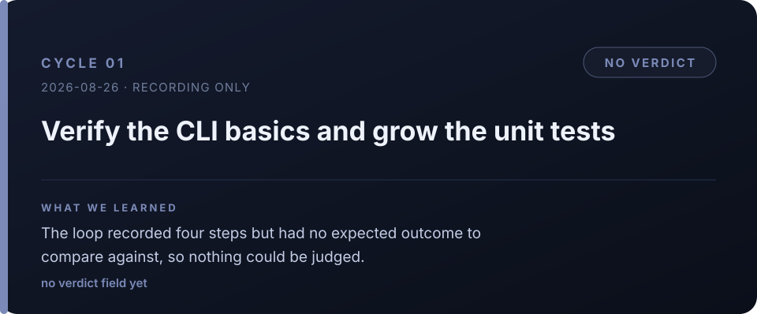

- **Plan** — Verify the pdsa-cli basics and strengthen the unit tests.
  - **Expected** — *(none — the `expected` field did not exist yet)*
- **Do** — Smoke-ran the CLI commands (`version`/`project`/`check`/`status`), confirmed graph writes
  and reads. **Discovered the test project did not reference pdsa-cli at all.**
- **Study** — No verdict (the `expected` field did not exist yet).
- **Act** — Add a `PdsaCli` reference and `InternalsVisibleTo` to the test project, then write
  ArgUtil/CommandRouter/PdsaCoach unit tests.

> **Learned — without a judging mechanism the loop is just a recorder.**
> This cycle did find a real defect (the tests did not even reference the CLI), but there was no
> criterion to say whether that counted as success. Recording four steps faithfully tells you nothing
> about improvement if there is nothing to compare against. That gap becomes the motivation for #4.

### #2 — Cover the pure Cli/Llm logic with unit tests

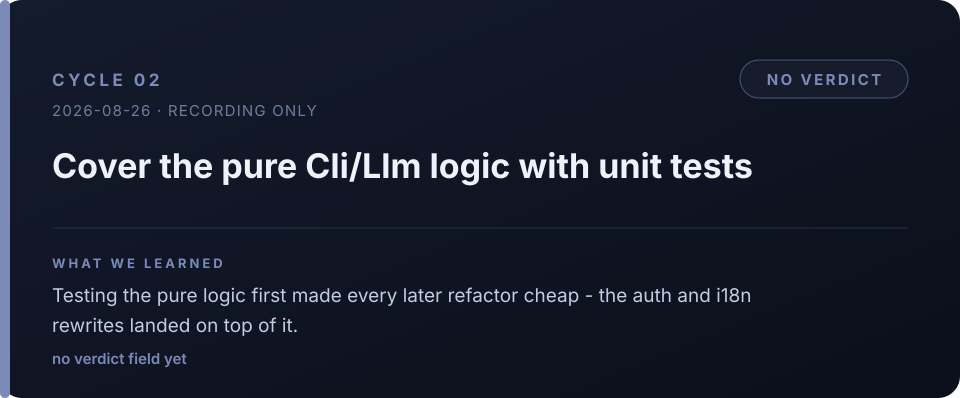

- **Plan** — Cover the pure Cli/Llm logic with unit tests.
  - **Expected** — *(none — the `expected` field did not exist yet)*
- **Do** — Added the `PdsaCli` reference and `InternalsVisibleTo` to the test csproj, promoted `Mask`
  to internal, wrote five test files across ArgUtil/CommandRouter/PdsaCoach/OpenAiConfig/PdsaProjectPaths.
- **Study** — No verdict.
- **Act** — Next: refactor PdsaSession/OpenAiClient for DI so commands are testable, add HTTP mocks,
  wire `dotnet test` into CI.

> **Learned — testing the pure logic first made every later rewrite cheap.**
> The ArgUtil and OpenAiConfig tests laid down here served as the regression gate through Era 3 (auth)
> and Era 4 (i18n). Auth was rebuilt three times, and "all existing tests green" was part of the
> expected outcome every time — affordable only because of this cycle.

### #3 — Graph viewer: show the active project, switch without a restart

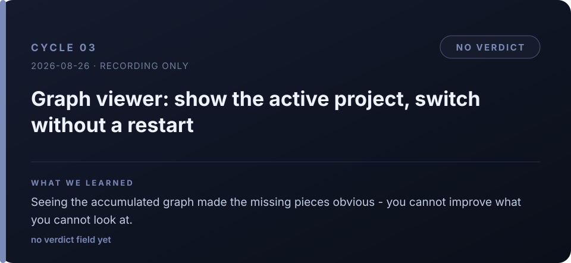

- **Plan** — Show the active project name and DB in the viewer header (the *which one is this* problem)
  and switch projects from a dropdown without restarting (the *selection* problem). Re-verify with Playwright.
  - **Expected** — *(none — the `expected` field did not exist yet)*
- **Do** — Added `/api/projects` and `/api/graph?project=` to the viewer, put the project name, DB and
  a select dropdown in the header, made `ViewCommand`/`ViewerLauncher` pass `--project`. Zero build warnings.
- **Study** — No verdict.
- **Act** — Next: integration tests for the viewer API, review project delete/rename UI.

> **Learned — you cannot improve what you cannot look at.**
> Once the accumulated graph was visible, what was missing became obvious: no expectations, no verdicts,
> no relationships between cycles. The very next cycle fills exactly that in. The viewer was not a
> feature so much as **the instrument that made the next improvement visible**.

---

## Era 2 · The loop closes

### #4 — Close the loop: expected → verdict → REINFORCES

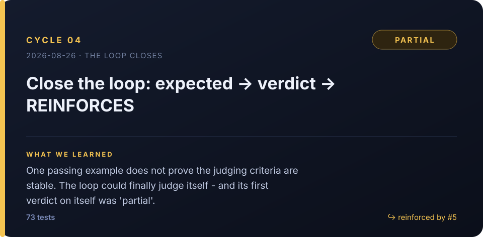

- **Plan** — Implement the Plan expected-outcome, the Study LLM verdict (met/partial/unmet), the Act
  reinforcement cycle (REINFORCES) and a hit-rate metric, in both the CLI and the graph view.
  - **Expected** — The expected outcome, verdict, reinforcement history and hit rate are all connected and displayed in both the CLI and the graph view, and verdicts across 10 representative cycles agree with pre-defined criteria at 90%+.
- **Do** — Added `expected/verdict/actual/reinforce` columns to `PdsaWorkflow` (ALTER migration) plus
  REINFORCES edges and HitRate, sentinel parsing in `PdsaCoach`, updates to Plan/Study/Act/Status/Eval,
  and verdict colors, edges and a hit-rate badge in the viewer.
- **Study** — Verdict **`partial`** · Actual: All 73 tests passed and the `partial → reinforce → met` flow was confirmed,
  but the eval hit rate was 1/2 (50%) and the "90% agreement across 10 representative cycles" check was never done.
- **Act** — The closed-loop feature is implemented and verified; assessing verdict stability is deferred. **Needs reinforcement (→ #5).**
  - **Reinforce** — `yes:` structure the Study input and judging criteria to raise verdict reproducibility

> **Learned — one passing example does not prove the judging criteria are stable.**
> A closed loop working and a verdict being *trustworthy* are different claims. This cycle demonstrated
> its own feature and still gave itself a `partial`. That honesty set the project's baseline: no later
> cycle got to pass on "it ran, so it worked", and 7 of the 18 judged cycles ended up with a non-clean verdict.

---

## Era 3 · Auth expansion — one key becomes five ways in

### #5 — Design first: extend LLM auth beyond a single API key

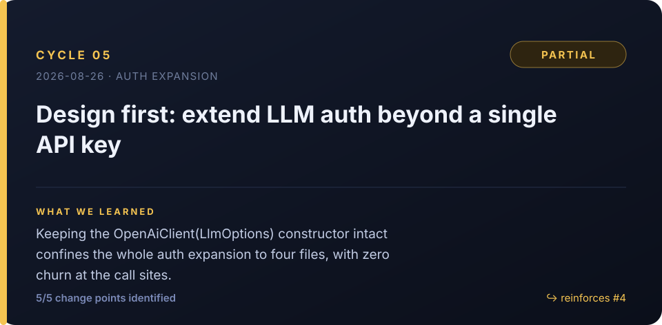

- **Plan** — Extend auth in two directions: keyless open-weight endpoints (ollama/vLLM/LM Studio) and
  GPT OAuth. The user's instruction was "plan before you adopt", so this cycle is **design only**.
  - **Expected** — The design doc specifies the config schema, the auth abstraction boundary and backward-compat rules for the existing API key, and includes config examples and acceptance criteria for keyless local/openai-compat and OAuth.
- **Do** — Grepped out every call site in the auth/config layer (5 of them: `LlmOptions`, the `OpenAiClient`
  constructor, `OpenAiConfig`, `ConfigCommand`, and the four client-construction sites). Key decision:
  **preserve the `new OpenAiClient(LlmOptions)` signature** and push `AuthMode` + `IAuthProvider` inside the client.
- **Study** — Verdict **`partial`** · Actual: The design settled config UX, the auth abstraction, five backward-compat
  regressions and the adoption order, and identified 5/5 change points — but concrete keyless/OAuth
  config examples and explicit acceptance criteria were missing.
- **Act** — Took the coaching and added four runnable JSON config examples and five measurable acceptance
  criteria to the design doc. **Reinforcement of #4.**
  - **Reinforce** — `yes:` settle and approve the design's three open questions as implementable decisions

> **Learned — preserving one constructor signature localizes the whole expansion.**
> That single decision confined the entire auth expansion to four files, and the four places that build
> a client were never touched again. Three more providers (OAuth, Codex, `claude -p`) landed later and
> the boundary held. **The deliverable of a design cycle is a boundary decision, not code.**

### #6 — Auth abstraction: AuthMode + IAuthProvider

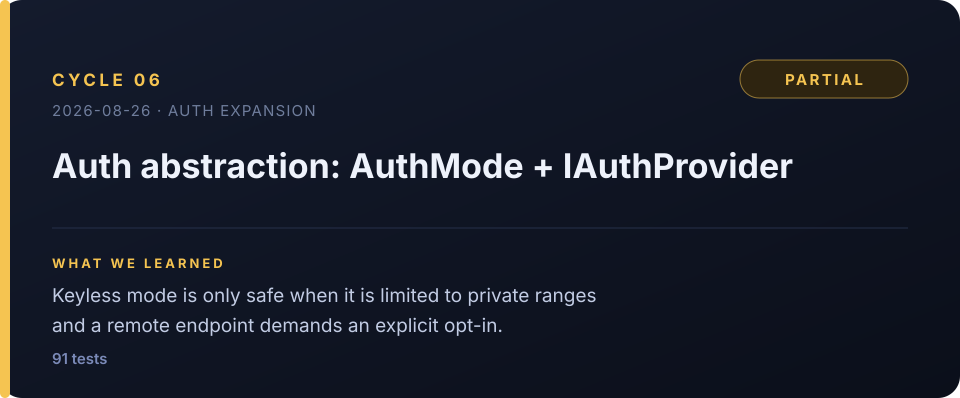

- **Plan** — Introduce `AuthMode(ApiKey|OAuth|None)` and `IAuthProvider`, defaulting to ApiKey for backward compatibility.
  - **Expected** — All 73 existing tests plus the new auth tests pass, the ApiKey default keeps its old behavior, and `provider local` loads without a key while remote endpoints stay blocked unless None is set explicitly.
- **Do** — Added `ApiKeyAuth`/`NoAuth`/`OAuthAuth` (stub) plus an `AuthProviders.Create` factory and
  `IsPrivateEndpoint` (loopback/RFC1918/fc00::/.local, with **DNS names treated as remote**).
  `OpenAiClient` now injects the header per request via `GetHeaderAsync`.
- **Study** — Verdict **`partial`** · Actual: 73→91 tests all green, keyless localhost load and remote no-key blocking confirmed —
  but the planned config-merge tests were not added and OAuth was still a stub.
- **Act** — Introduce config path injection and verify the `repo < global < env` merge order with isolated
  unit tests. **Needs reinforcement (→ #7).**
  - **Reinforce** — `yes:` introduce config path injection and verify `repo<global<env` merge precedence with isolated unit tests

> **Learned — removing the key and removing it safely are different things.**
> Dropping key validation outright opens a hole where a remote endpoint gets contacted with no auth.
> Auto-allowing private ranges while demanding **explicit opt-in** for remote satisfied both keyless
> local usability and remote safety. A security boundary attached to a convenience feature has to be
> decided in the same cycle as the feature.

### #7 — Keyless open-weight E2E and config-merge tests

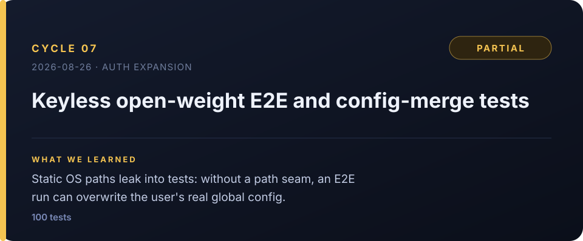

- **Plan** — A path-injection seam, isolated config-merge tests, and a real keyless E2E against
  `a1.webnori.com` (no key required).
  - **Expected** — All 91 existing tests pass, the new merge tests verify `repo<global<env` precedence for four fields each, and the E2E returns OK with opt-in while blocking unauthenticated remote use without it.
- **Do** — Added a path seam to `OpenAiConfig` (`PDSA_GLOBAL_CONFIG` env plus internal overrides) and routed
  eight path references through it; wrote nine new merge test cases. **A serious incident happened and was
  reverted**: `GetFolderPath` ignores the `LOCALAPPDATA` environment variable, so the test run **overwrote
  the user's real global config**.
- **Study** — Verdict **`partial`** · Actual: 100 tests and zero warnings; the E2E confirmed blocking without opt-in (exit 3)
  and a successful keyless `check` after opt-in (1,270ms) — but the four fields named in the expected
  outcome were not the four fields actually verified.
- **Act** — Lock the global-only policy for `allow_insecure_no_auth` (repo/env ignored) with an automated test.
  **Reinforcement of #6.**
  - **Reinforce** — `yes:` pin the global-only policy for `allow_insecure_no_auth`, including repo/env being ignored

> **Learned — the path-injection seam comes before the integration test.**
> Attempting an E2E while static OS paths are referenced directly lets the test overwrite the user's real
> configuration. It actually happened, and it was reverted. The lesson is not "write tests carefully" but a
> structural rule: **code that touches OS paths needs an injection point first.**

### #8 — GPT OAuth: refresh, persist, device-code polling

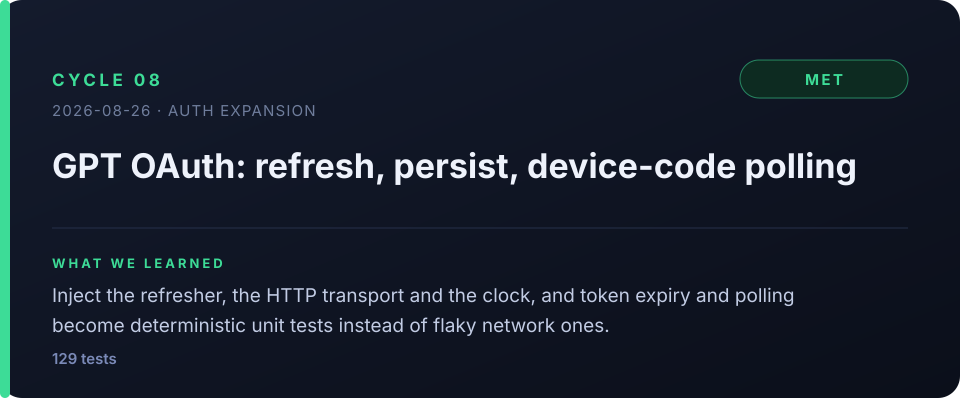

- **Plan** — Implement the token lifecycle for real: `OAuthToken`/`ITokenRefresher`, expiry → refresh →
  Bearer → persist, and the device-code login flow.
  - **Expected** — All 102 existing tests plus the new OAuth core, config and device-code polling tests pass with zero warnings, and expiry/valid tokens, persist, no effect on ApiKey/None, and the pending/slow_down/success transitions are all reproduced in tests.
- **Do** — `HttpTokenRefresher` (injected `HttpMessageHandler`), a device-code polling state machine with
  injected `delay` and `now`, `OAuthAuth` promoted from stub to real (30s expiry skew), plus `config oauth` and `config login`.
- **Study** — Verdict **`met`** · Actual: 102→129 tests green, zero warnings. Token refresh, persist, no effect on ApiKey/None,
  the device-code `pending`/`slow_down`/success transitions and non-exposure of `refresh_token` were all
  covered by tests.
- **Act** — Three auth modes (ApiKey / keyless / OAuth) complete. Still unverified: a real OAuth provider E2E
  and atomic writes for `refresh_token_file`.
  - **Reinforce** — `yes:` harden `refresh_token_file` writes with atomic replace and owner-only permissions

> **Learned — inject time and the network, and OAuth becomes a deterministic unit test.**
> Making the refresher, the HTTP transport and the clock (`Func<long>`) all injectable turned "you have to
> wait to find out" states — expiry, refresh, polling — into fixed tests with no flaky integration run.
> This cycle also produced the insight that device-code polling is a state machine: `slow_down` backoff,
> denial, expiry and deadline all matter. Era 3's three `partial`s closed here as a `met`.

---

## Era 4 · Ship and localize

### #9 — pdsa init: embed the skill inside the binary

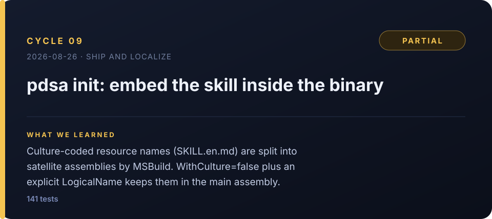

- **Plan** — Add `pdsa init`, which installs the PDSA skill (`.claude/skills/pdsa/SKILL.md`) into the current
  workspace, using AOT-safe embedded resources.
  - **Expected** — `pdsa init --lang en|ko --yes` produces a valid `SKILL.md` from the AOT publish output, all existing 102+ tests plus new resource/path/overwrite tests pass, and there are zero build warnings.
- **Do** — **Found the trap**: MSBuild's `AssignCulture` read the `.en`/`.ko` in the filenames as culture codes
  and split the resources into satellite assemblies (both colliding as `PdsaCli.Resources.SKILL.md`), leaving
  **zero resources in the main dll**. Fixed with `WithCulture=false` plus an explicit `LogicalName`.
- **Study** — Verdict **`partial`** · Actual: 129→141 tests, 12 new, real CLI E2E for create/protect/force-overwrite, zero warnings —
  but running `init` from the actual AOT native exe was never verified (link environment problem).
- **Act** — Verify `init` from a native exe in a working link environment or in CI.
  - **Reinforce** — `yes:` actually run `pdsa init` from the AOT native exe in a working link environment or CI

> **Learned — a successful build can still lose your resources.**
> `--getItem` made it look embedded while the actual manifest was empty. The only decisive checks were
> `GetManifestResourceNames` and an actual load test. **"Does the build output contain what it was supposed
> to?" is a separate verification from "did the build succeed?"**

### #10 — i18n across help, coaching and config

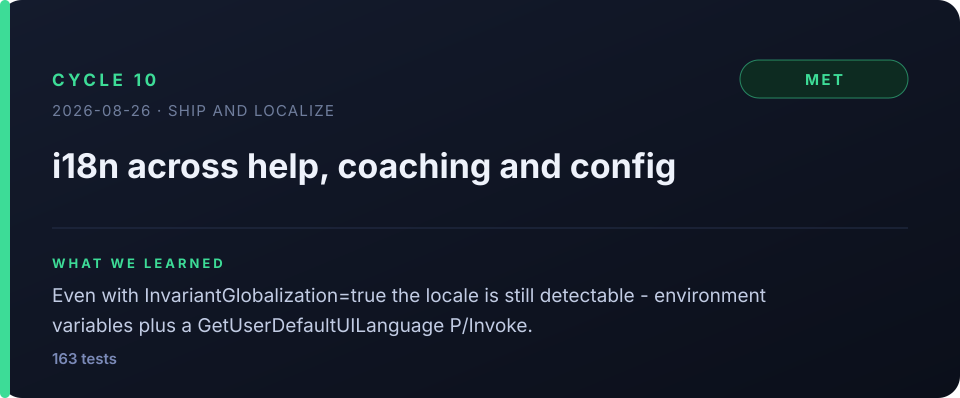

- **Plan** — Implement the language precedence `--lang > PDSA_LANG > config > OS locale > en` and branch help
  text and coach prompts between ko and en.
  - **Expected** — All 141 existing tests plus the new i18n precedence, Korean detection, prompt-language and help-branching tests pass with zero warnings, and `--lang > PDSA_LANG > config > OS locale > en` reproduces in each isolated scenario.
- **Do** — A pure `PdsaLang.Resolve` function plus OS detection (env `LANG`/`LC_ALL`/… and a Windows
  `GetUserDefaultUILanguage` P/Invoke). `InvariantGlobalization=true` rules out `CultureInfo`, and
  `LibraryImport` required unsafe, so `DllImport` was used instead (AOT-safe).
- **Study** — Verdict **`met`** · Actual: 141→163 tests green, zero warnings. All five precedence levels reproduce in isolated
  scenarios and Korean OS-locale auto-detection was confirmed in the real CLI.
- **Act** — Full per-command usage i18n and Windows locale integration tests deferred. No reinforcement needed.
  - **Reinforce** — `no`

> **Learned — constraints have detours, and pure functions make them verifiable.**
> Turning on `InvariantGlobalization=true` for AOT cost the standard locale API, but environment variables
> plus a P/Invoke produced the same answer. More importantly, **language resolution was isolated into one
> side-effect-free `Resolve`**, which is what let all five precedence levels be pinned by unit tests.

---

## Era 5 · Self-model providers — let the agent use its own model

### #11 — Codex OAuth mode, reusing `~/.codex/auth.json`

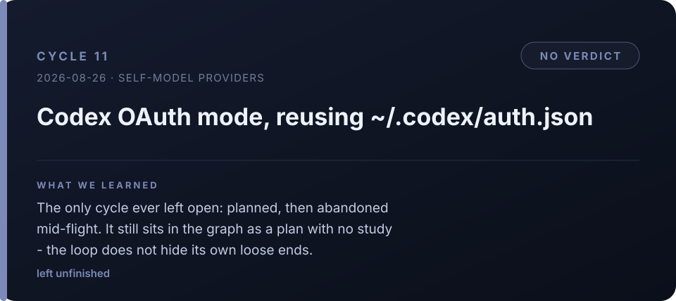

- **Plan** — Let Codex subscribers reuse the official `codex login` artifacts with pdsa. Recorded the whole
  mechanism: token source, refresh endpoint, `account_id` extraction, `/responses` SSE.
  - **Expected** — All 163 existing tests plus the new Codex unit tests pass with zero warnings, and the user confirms login, refresh and an SSE response at least once with a real `auth.json`.
- **Do** — *(no record)*
- **Study** — *(no record)*
- **Act** — *(no record)*
- **Cycle status** — `planned` — the only cycle of 22 not marked `acted`. Machine-readable evidence of abandonment.

> **Learned — the loop does not erase its own loose ends.**
> The only cycle of 22 abandoned mid-flight. It has a plan, no study, and therefore no verdict. That blank is
> not a data gap, it is **the record**. When #21 later fixed "a failed plan leaves an orphan cycle", cycles
> like this one are exactly why a legitimately open cycle had to be distinguished from an accidental orphan.

### #12 — Research official self-model provider paths

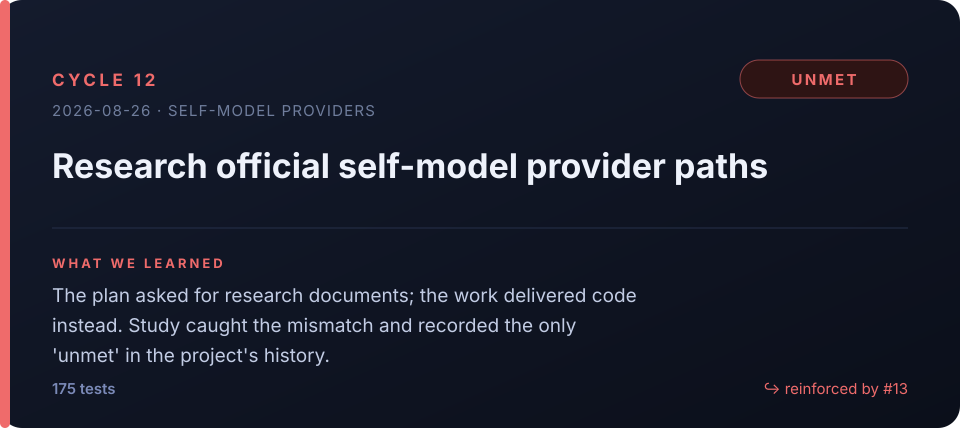

- **Plan** — Research the **official** ways an agent like Claude Code can use its own model (MCP sampling,
  `claude -p`, Agent SDK), avoiding prompt-injection workarounds. **This session is research only** — leave
  design and survey documents under `docs/`.
  - **Expected** — At least one design document and one comparison table live under `docs/`, covering support, auth, I/O constraints, difficulty and source URLs per official integration path, with one adoption candidate explicitly named.
- **Do** — **Implemented** Codex (GPT subscription) OAuth mode instead: `Codex.cs` (auth.json reuse + JWT +
  refresh rewrite), `CodexClient` (Responses SSE), `AuthMode.Codex`, `config auth codex`. 163→175 tests passing.
- **Study** — Verdict **`unmet`** · Actual: The implementation, tests and config smoke all checked out, but **the expected
  `docs/` design document, comparison table, source URLs and adoption verdict were nowhere.**
- **Act** — Have a logged-in Codex user run one real E2E to verify token refresh and `/responses` SSE.
  **Needs reinforcement (→ #13).**
  - **Reinforce** — `yes:` have a logged-in Codex user verify token refresh and `/responses` SSE in one real E2E, collecting failure evidence

> **Learned — good work that does not match the plan is still a failure.**
> This cycle produced a genuinely useful feature and added 12 tests. The verdict is still `unmet`, because
> the expected outcome was "research documents" and the deliverable was code. **Judging against the
> expectation rather than against the output** produced this project's only `unmet` — and made the next
> cycle possible.

### #13 — Write the provider survey and design docs

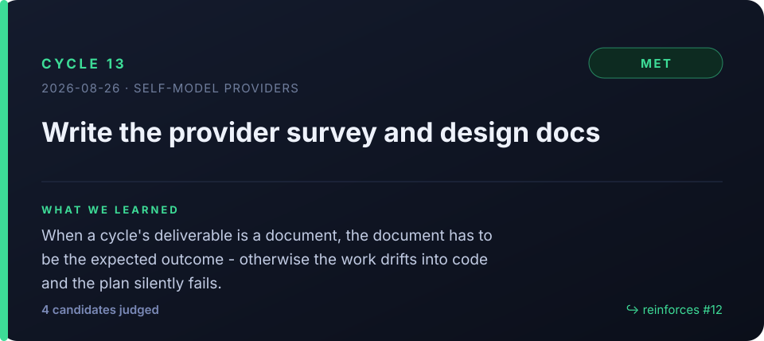

- **Plan** — Produce what #12 did not. Write a survey and a design document under `docs/` and name an
  adoption verdict.
  - **Expected** — A survey and a design document exist under `docs/`, comparing at least three LLM providers on cost, model performance, API/Claude Code compatibility and security, with an adopt/hold/reject verdict stated.
- **Do** — Ran two subagents in parallel for (a) a map of the pdsa LLM provider architecture and (b) a survey
  of official Claude Code mechanisms. Wrote `claude-code-self-llm-조사.md` (4 candidates compared, with source
  URLs) and `claude-code-provider-설계.md` (6 insertion points, the factory-bypass trap, 5 open questions).
- **Study** — Verdict **`met`** · Actual: Compared four candidates on cost, performance/fit, integration, .NET AOT, official
  stability and immediate feasibility, landing on **D conditionally adopted (ToS first), B as fallback,
  A rejected, C not recommended.**
- **Act** — Survey and design complete, **no implementation (plan-first rule)**. No reinforcement needed.
  - **Reinforce** — `no`

> **Learned — when the deliverable is a document, the document has to be the expected outcome.**
> #12 did not fail out of laziness; it failed because the expected outcome and the actual work were
> misaligned. Re-running the same subject with the document *as* the expected outcome produced a `met`
> on the first try. What makes the difference is deciding **what will count as success**, not what to build.

### #14 — Adopt `claude -p` as an LLM provider

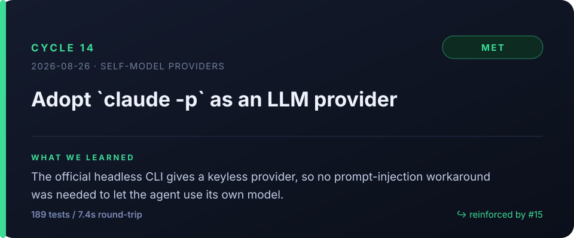

- **Plan** — Formally adopt and implement the design's P2 fallback (`claude -p`) on the user's instruction:
  official, keyless, no ToS workaround.
  - **Expected** — All 175 existing tests plus the new ClaudeCli unit tests pass with zero warnings, and after `config auth claude-cli` at least one real `claude -p` call returns a successful `result` with PDSA tags correctly extracted.
- **Do** — `ClaudeCli.cs` (executable resolution: env > config > PATH), `ClaudeCliClient.cs`
  (`claude -p --output-format json --max-turns 1 --append-system-prompt`, passed through `ArgumentList` so
  nothing needs escaping), `AuthMode.ClaudeCli`, factory and Guide routing.
- **Study** — Verdict **`met`** · Actual: 175→189 tests green, zero warnings. A real `claude -p` round trip (**7,411ms**) returned
  `result=OK` and PDSA tag extraction was verified.
- **Act** — Fully verified (keyless, no billing). **Needs reinforcement (→ #15): user feedback and a timeout for
  the ~7.4s CLI start-up delay.**
  - **Reinforce** — `yes:` immediately add user feedback and a timeout policy for the ~7.4s Claude CLI start-up delay

> **Learned — when an official path exists, no workaround is needed.**
> "Let the agent use its own model" invites hacks like prompt injection. Calling the official headless CLI as a
> subprocess achieved the same goal with no key and no billing. It also **measured the cost: 7.4 seconds** —
> and that number became the plan for #18. A measured annoyance is an input to the next cycle.

---

## Era 6 · Real-use defects — the ones only dogfooding finds

### #15 — Multi-project: `--project` on every command

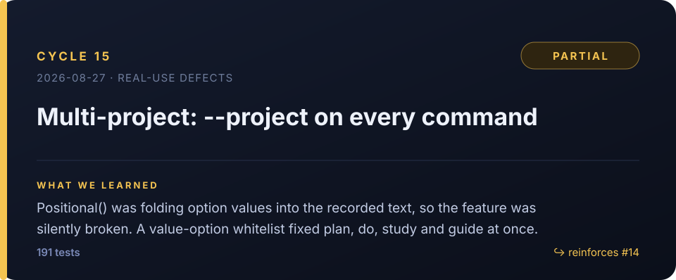

- **Plan** — Make `--project` run against that project's DB independently of the global `project set` state.
  **`ArgUtil.Positional` currently folds option *values* into the recorded body, so this feature is silently broken.**
  - **Expected** — Running plan/do/study/act concurrently on two different projects via `--project` leaves no option value in any recorded body, stores every record only in the named project's DB, and keeps 100% of tests passing.
- **Do** — Added a value-option whitelist to `ArgUtil` (11 options including `--expect`/`--project`/`--note`) and
  rewrote `Positional` to skip value tokens — fixing plan/do/study/guide in one go — plus three boundary unit tests.
- **Study** — Verdict **`partial`** · Actual: Concurrent `plan --project` on two projects showed zero body contamination, separate
  DBs and 191 tests passing — but **the full do/study/act chain was never demonstrated concurrently.**
- **Act** — Actually run the full chain in parallel across two projects and verify end to end. **Needs reinforcement (→ #16).**
  - **Reinforce** — `yes:` actually run the full p/d/s/a chain in parallel across two projects and verify end to end

> **Learned — "the feature exists" and "the feature works" are different claims.**
> `--project` had been parsed for a while, but its value leaked into the recorded text, making it effectively
> unusable. A documented feature quietly being broken is something only **actual use** reveals. And Act refused
> to accept "structurally guaranteed" as an argument — it demanded a demonstration.

### #16 — Reinforcement: close the gap #15 never demonstrated

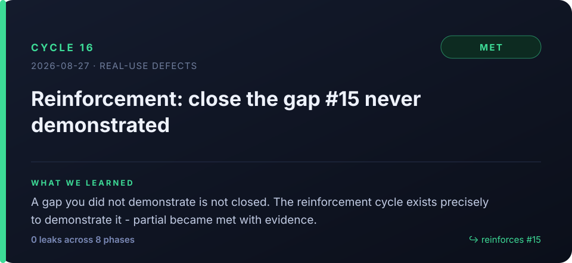

- **Plan** — Close #15's undemonstrated gap (full p/d/s/a chain, concurrent) with a real measurement.
  - **Expected** — After a concurrent `--project` E2E across two projects, all four phases are recorded, no record leaks the project-name option value, and grep plus a DB query confirm each record landed only in its own project's DB.
- **Do** — Ran plan→do→study→act concurrently on two throwaway projects (`zz-fc-a`, `zz-fc-b`) via `--project`
  (bash background jobs + wait), then grepped each project's status phase lines for project-name tokens, and
  cleaned up the throwaway DBs afterwards.
- **Study** — Verdict **`met`** · Actual: All four phases recorded in both projects, **grep for own and other project names across
  8 phase inputs returned 0 hits**, and zero parallel-execution collisions.
- **Act** — Done. Asserting record counts by querying Kùzu directly, instead of grep, would harden the regression
  further. No reinforcement needed.
  - **Reinforce** — `no`

> **Learned — a reinforcement cycle is not "do it again", it is "prove it".**
> #15 had already fixed the code and its reasoning was sound. All #16 added was **evidence**. That is the point of
> the `partial → reinforce → met` pattern: an unproven claim is not rounded up to success, but it is not thrown
> away either — it gets closed cheaply in the next cycle.

### #17 — Run the viewer in-process for the AOT single file

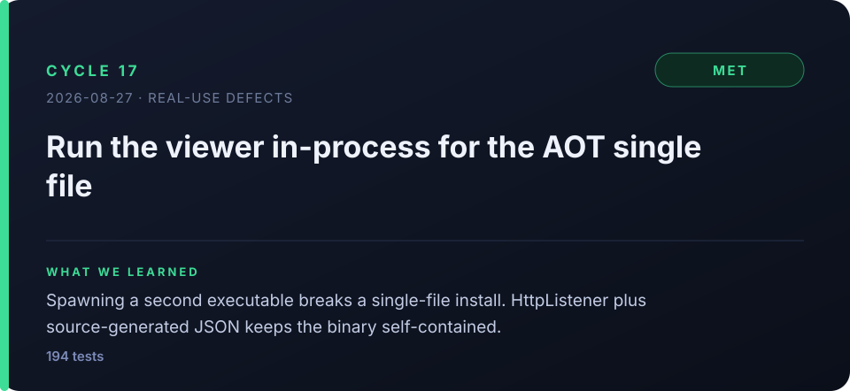

- **Plan** — `pdsa view` spawns a separate Viewer exe, so it fails on an AOT install with "viewer not found".
  Serve it in-process from the CLI with `HttpListener` instead.
  - **Expected** — On the AOT single file, `view` starts a localhost server with no separate Viewer exe, `/`, `/api/projects` and `/api/graph` all answer 200 under the camelCase contract, and the full test suite passes.
- **Do** — Moved `ViewerHtml` into Core so the standalone viewer and the CLI share it, added `ViewerServer.cs`
  to the CLI (`/`, `/api/projects`, `/api/graph`), and serialized JSON through an STJ source-gen context for AOT safety.
- **Study** — Verdict **`met`** · Actual: The AOT single `pdsa.exe` (40MB) started the server with no separate dll, all three routes
  returned 200 with the camelCase contract, and 194 tests passed.
- **Act** — Done. Automating a view smoke test against AOT artifacts on three OSes in CI is follow-up. No reinforcement needed.
  - **Reinforce** — `no`

> **Learned — single-file distribution breaks the assumption that you can spawn another process.**
> A feature that worked perfectly in the dev tree failed only in the install. The moment an AOT single file is the
> distribution format, **every external-executable dependency becomes debt**. The corollary followed for free:
> reflection-based serialization is unusable for the same reason, so source-generated JSON became the default.

### #18 — Timeout and spinner for the Claude CLI provider

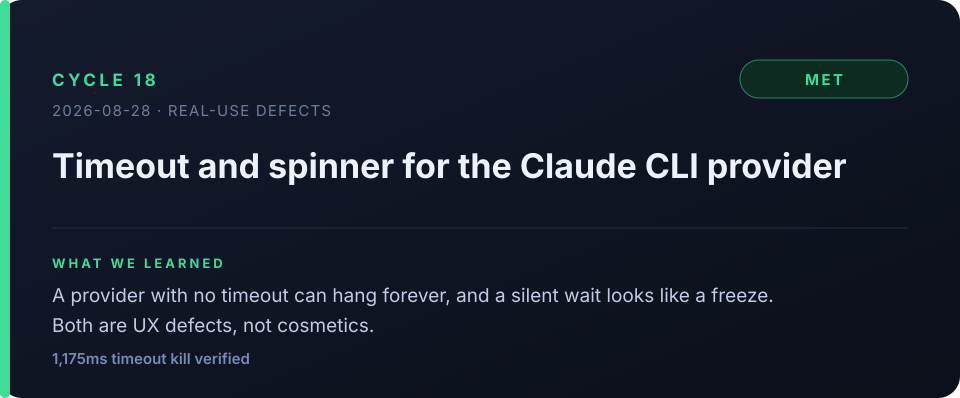

- **Plan** — Carried over from #14: `claude -p` round trips take 7.4s, there is no timeout (hang risk), and the
  silent wait looks like a freeze. Add a configurable timeout (env > config > 180s) and an interactive spinner.
  - **Expected** — The precedence (env > config > 180s) is verified by tests, the process is killed on timeout, the spinner shows on an interactive terminal, and redirected stdout contains zero spinner output.
- **Do** — `ResolveTimeout()` plus a pure `ParseTimeout`, a linked CTS that raises `TimeoutException` (with tuning
  guidance) only when the internal token fires, and `Kill(entireProcessTree)` on cancellation. New `Cli/Spinner.cs`
  wrapped around six coaching call sites, writing to stderr and doing nothing when redirected.
- **Study** — Verdict **`met`** · Actual: Precedence pinned by a 5-case Theory and an E2E (env=1s overriding config=90s);
  **a 1,175ms timeout, the process kill and the guidance message**, the TTY spinner, and **zero control characters
  in redirected stdout** were all verified.
- **Act** — Carried-over item closed. No reinforcement needed.
  - **Reinforce** — `no`

> **Learned — the waiting experience is as much a verification target as correctness.**
> "It's slow", observed in #14, became a concrete plan four cycles later. And while adding the spinner, the cycle
> also verified **zero control characters in redirected stdout** — pinning, in the same cycle, the constraint that
> a UX improvement must not contaminate the output an agent reads.

---

## Era 7 · Agent-friendly — the memory starts compounding

### #19 — Structured `--json` output, recall, `--full`

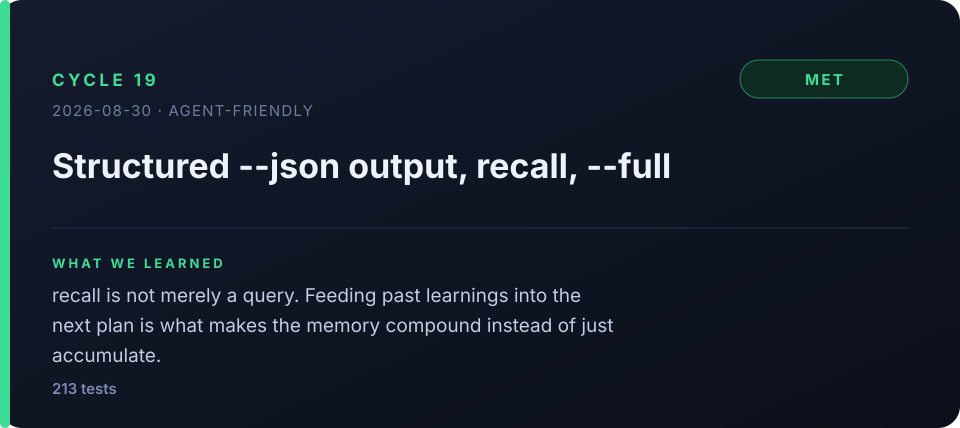

- **Plan** — (1) opt-in `--json` structured output on seven commands, (2) `pdsa recall` and `RecentLearnings` to
  inject past learnings into `plan` coaching automatically, (3) `status/eval --full` without truncation.
  Design settled first, per the plan-first rule.
  - **Expected** — `--json` on seven commands is verified against the camelCase schema through AOT source-gen serialization, recall's learnings reach `plan` coaching automatically, `status/eval --full` print untruncated, and all tests pass.
- **Do** — A `PdsaJson` STJ source-gen context (camelCase) and new DTOs, `--json` branches on six commands
  (**prose output unchanged**), a `priorLearnings` parameter on `PdsaCoach.HypothesisAsync` injecting a
  `[past learnings]` block, `PlanCommand` collecting K=3 (`--no-recall` opts out), and a new `RecallCommand`.
- **Study** — Verdict **`met`** · Actual: All seven commands emit valid camelCase JSON, recall→plan injection confirmed,
  `--full` untruncated, 204→213 tests passing and **no prose regression**.
- **Act** — Committed and pushed. Backlog: a JSON schema version field, exposing injection-count metadata,
  semantic recall. No reinforcement needed.
  - **Reinforce** — `no`

> **Learned — this is where the graph stopped being an archive and became an input.**
> `--json` is the contract that stops an agent from regex-scraping Korean prose, but `recall` was the larger change.
> With past learnings flowing automatically into the next `plan`, the memory shifted from **merely accumulating to
> compounding**. Later cycles picking up exactly where the previous one left off is this mechanism at work.

---

## Era 8 · The loop audits itself

### #20 — Survey Akka.NET Streams and adjacent stacks

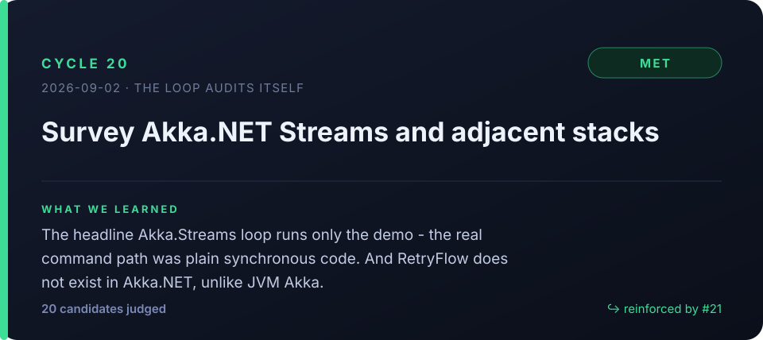

- **Plan** — Survey the unused Akka.NET Streams specs and adjacent stacks (OpenTelemetry, Polly, …) and pick the
  candidates worth adopting, judged on safety, efficiency, adoption cost and post-adoption checks.
  - **Expected** — A `docs/` document covers 100% of the surveyed technologies with usage evidence, a four-lens evaluation, a verification method and a now/next/later/reject verdict, and at least one 'now' candidate has quantitative success metrics.
- **Do** — Three axes: codebase measurement, failure injection, API existence verification. **`IPdsaEngine` is
  referenced in exactly one place, `RunCommand.cs:13`** — Akka.Streams runs only the demo, while the real
  plan/do/study/act path is plain synchronous Kùzu calls. Zero transactions, zero orphan cleanup, zero retries.
  A nuget XML search showed **`RetryFlow` has 0 hits in Akka.NET (absent)**. Failure injection reproduced the
  orphan cycle (2/2).
- **Study** — Verdict **`met`** · Actual: All 20 candidates got evidence, a four-lens evaluation, a verification method and a
  now/next/later/reject verdict, plus five quantitative targets for the "now" candidates.
- **Act** — Kept the measured baseline (100% orphan rate, cold start, 52MB binary) as the regression reference for
  the next cycle. **Needs reinforcement (→ #21).**
  - **Reinforce** — `yes:` make PlanCommand's write order atomic so a cycle is created only after the LLM result is verified

> **Learned — check where your headline technology actually runs.**
> The Akka.Streams feedback loop this repository is named after was running **only in the demo**. That reduced
> "let's adopt more Akka specs" to "is an ActorSystem worth it in a 0.2–3s CLI", and the answer was no. Also:
> **do not assume a .NET API from JVM Akka docs** — `RetryFlow` was never ported.

### #21 — Atomicity, bounded retry, per-phase metrics

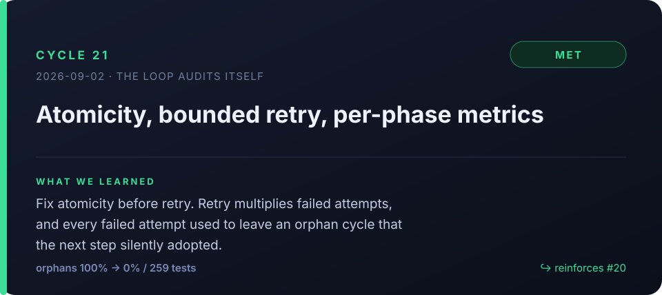

- **Plan** — Implement #20's three "now" items with **zero new dependencies**: N1 atomicity (no orphan cycles),
  N3 bounded retry, N2 per-phase metrics.
  - **Expected** — 20 injected failures leave zero plan-less orphan cycles, retryable errors are retried at most twice, a new cycle's Study input carries latencyMs/attempts/tokens, and tests, cold start and binary size show no regression.
- **Do** — Before building `KuzuGraph.BeginTransaction`, **verified the C API actually supports it with four tests**
  (they passed, so the prepared compensating-delete fallback was unnecessary). `StartCycleWithPlan` wraps
  cycle + edges + plan phase in one transaction, and Do/Study/Act now refuse a plan-less cycle. `RetryPolicy` retries
  only 429/5xx/socket/timeout, propagating 4xx and cancellation immediately, with `check` at zero retries. Five metric
  columns rode in on the existing ALTER migration path, and usage is collected through an optional
  `ILlmUsageReporter` without touching the `ILlmClient` signature.
- **Study** — Verdict **`met`** · Actual: 20 injected failures produced **0 orphans** (baseline 100%), the retry policy is pinned by
  17 tests, a real cycle recorded `latencyMs`/`attempts`/tokens and fed them into Study, and 259 tests, a 39MB AOT
  binary and cold start all showed no regression.
- **Act** — Opened PR #4. This cycle's Study coaching **cited its own metrics as judging evidence**, demonstrating
  the feedback end to end. No reinforcement needed.
  - **Reinforce** — `no`
- **Metrics** — do 22,179ms · study 11,063ms · act 4,175ms (5,448/2,435 tokens total)

> **Learned — the order matters more than the individual fixes.**
> The natural order was "retry first", and that was precisely the wrong one. Retry multiplies failed attempts, and
> every failed attempt was leaving an orphan cycle that the next `do` silently adopted. **Adding retry before
> atomicity would only have amplified the corruption.** A side lesson: the cold-start A/B showed a 45% improvement
> that did not exist, because the npm shell wrapper was adding ~190ms to the baseline — **the measuring instrument
> is part of the system.**

### #22 — `history` and `show`: query the loop's own past

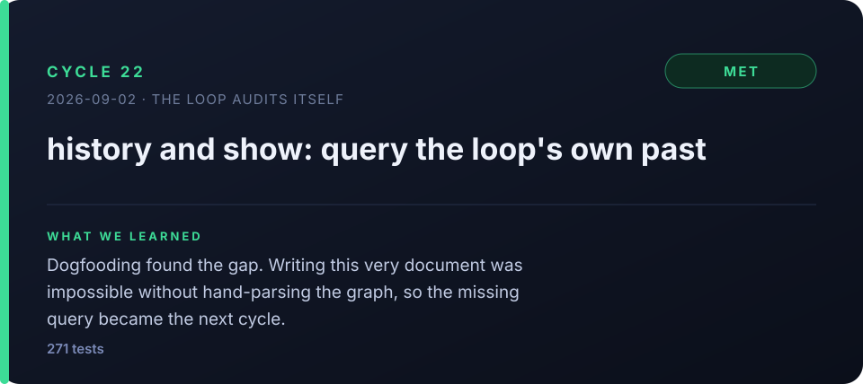

- **Plan** — There is no per-cycle retrieval. With only `status` (newest-first dump), `eval` and `recall`, you cannot
  address a specific cycle, read the timeline oldest-first, or select a range, and REINFORCES is readable only in the
  viewer. Add `show` and `history`.
  - **Expected** — Against the real 21-cycle DB, `show` and `history` return each cycle's expected → verdict → actual → learning, metrics and REINFORCES correctly; range, ordering, JSON, legacy-schema compatibility and the full suite pass; and the whole narrative is writable from CLI output alone.
- **Do** — Added `Cycle(id)`, `Range(from, to, ascending, limit)` and `ReinforceLinks(id)` to Core, and made a private
  **`Fetch()` the single retrieval path**, reimplementing `Recent()` on top of it — with no per-command query there is
  nothing to drift, and a structural test asserts all three APIs agree on the same cycle. `CycleMap` unified the
  cycle-to-JSON mapping across status/show/history.
- **Study** — Verdict **`met`** · Actual: Correct output across the real 21-cycle DB, both directions of REINFORCES, boundary cases
  (missing cycle exit 3, from>to exit 2, …), legacy-schema compatibility, 271 tests passing. **And this document's
  narrative was extracted from CLI output alone — 0 direct JSON parses, against a baseline of 1.**
- **Act** — Committed into the PR. The extracted narrative became the document you are reading. No reinforcement needed.
  - **Reinforce** — `no`
- **Metrics** — plan 6,659ms · do 19,233ms · study 9,003ms · act 4,990ms (6,592/2,482 tokens total)

> **Learned — using the tool is what exposes the tool's defects.**
> This retrieval feature did not come out of a design review. It came from **trying to write this document** and
> discovering the graph had to be parsed by hand. That was the cheapest discovery path of all 22 cycles, and #21's
> orphan-cycle defect came the same way (a failure-injection experiment). Also: retrieval consistency is better
> guaranteed by **collapsing the read path into one** than by testing each command's output — as commands multiply,
> disagreement becomes structurally impossible.

---

## Five things that run through all 22

**1. Writing the expected outcome first is what makes improvement measurable.**
Cycles 1–3 produced real work and left no way to tell whether it succeeded. The verdict field is what turned
"we did things" into "we predicted 18 outcomes and hit 11."

**2. `partial` is the useful verdict.** Seven of the eighteen judged cycles were not clean successes
(six `partial`, one `unmet`). Each named a specific unproven claim, and three of them — #4, #12 and #15 — were
closed by an explicit reinforcement cycle rather than being quietly forgotten.

**3. Dogfooding finds what design reviews miss.** The orphan-cycle defect in #21 and the missing query commands in
#22 were both found by *using* the tool, not by reading the code. So was #15's parsing defect.

**4. Order matters more than the individual fixes.** #21's central finding was not "add retry" but "do not add retry
before atomicity". #7's "path seam before integration test" is the same shape of lesson.

**5. The measuring instrument is part of the system.** #21's cold-start comparison showed a 45% improvement that did
not exist; the npm shell wrapper was adding ~190ms to the baseline. The number was corrected in the record rather
than kept.

---

## Reading the raw record yourself

Nothing here is a summary you have to trust — every cycle is queryable:

```bash
pdsa history --project akka-graph-loop                # timeline, oldest first
pdsa history --from 15 --to 16 --full                 # one reinforcement pair, untruncated
pdsa show 21 --full                                   # a cycle's four phases, metrics, links
pdsa history --json | jq '.cycles[] | {id, verdict}'  # machine-readable
pdsa view                                             # the graph itself, in a browser
```

Cards are generated from the same records by [`cards/_generate.py`](cards/_generate.py)
(English in `cards/`, Korean in `cards-ko/`).
